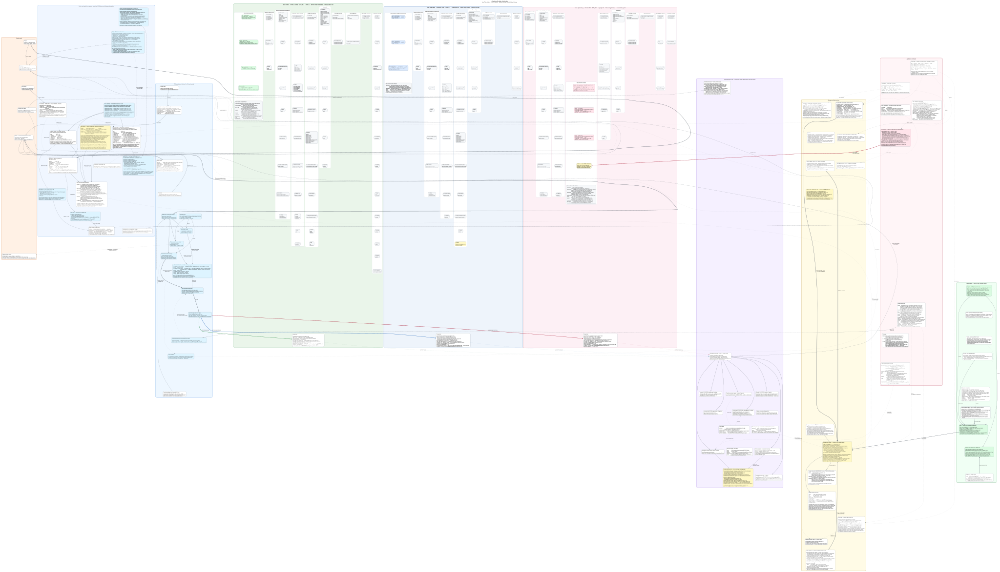

<div align="center">


### Keiretsu — Multi-Cluster Kubernetes Infrastructure

_Managed with Flux, Tailscale, and GitHub Actions_

</div>

<div align="center">

#### Ottawa

[](https://talos.dev)&nbsp;&nbsp;
[](https://kubernetes.io)&nbsp;&nbsp;
[](https://fluxcd.io)&nbsp;&nbsp;
[](https://tailscale.com/kb/1236/kubernetes-operator)

[](https://status.killinit.cc)&nbsp;&nbsp;
[](https://status.killinit.cc)&nbsp;&nbsp;

[](https://github.com/home-operations/kromgo)&nbsp;&nbsp;
[](https://github.com/home-operations/kromgo)&nbsp;&nbsp;
[](https://github.com/home-operations/kromgo)&nbsp;&nbsp;
[](https://github.com/home-operations/kromgo)&nbsp;&nbsp;
[](https://github.com/home-operations/kromgo)&nbsp;&nbsp;
[](https://github.com/home-operations/kromgo)&nbsp;&nbsp;
[](https://github.com/home-operations/kromgo)

</div>

<div align="center">

#### Robbinsdale

[](https://talos.dev)&nbsp;&nbsp;
[](https://kubernetes.io)&nbsp;&nbsp;
[](https://fluxcd.io)&nbsp;&nbsp;
[](https://tailscale.com/kb/1236/kubernetes-operator)

[](https://status.lukehouge.com)&nbsp;&nbsp;
[](https://status.lukehouge.com)&nbsp;&nbsp;

[](https://github.com/home-operations/kromgo)&nbsp;&nbsp;
[](https://github.com/home-operations/kromgo)&nbsp;&nbsp;
[](https://github.com/home-operations/kromgo)&nbsp;&nbsp;
[](https://github.com/home-operations/kromgo)&nbsp;&nbsp;
[](https://github.com/home-operations/kromgo)&nbsp;&nbsp;
[](https://github.com/home-operations/kromgo)&nbsp;&nbsp;
[](https://github.com/home-operations/kromgo)

</div>

<div align="center">

#### St. Petersburg

[](https://talos.dev)&nbsp;&nbsp;
[](https://kubernetes.io)&nbsp;&nbsp;
[](https://fluxcd.io)&nbsp;&nbsp;
[](https://tailscale.com/kb/1236/kubernetes-operator)

[](https://status.rajsingh.info)&nbsp;&nbsp;
[](https://status.rajsingh.info)&nbsp;&nbsp;

[](https://github.com/home-operations/kromgo)&nbsp;&nbsp;
[](https://github.com/home-operations/kromgo)&nbsp;&nbsp;
[](https://github.com/home-operations/kromgo)&nbsp;&nbsp;
[](https://github.com/home-operations/kromgo)&nbsp;&nbsp;
[](https://github.com/home-operations/kromgo)&nbsp;&nbsp;
[](https://github.com/home-operations/kromgo)&nbsp;&nbsp;
[](https://github.com/home-operations/kromgo)

</div>

---

Multi-cluster Kubernetes infrastructure managed with FluxCD GitOps. The three
Talos Linux clusters are connected by a Tailscale mesh and share the same
repository, platform conventions, and observability stack.

## Architecture

The graph below is the whole system in one place: the machines, the delivery
pipeline, the tailnet overlay, the three ingress tiers and their separate DNS
planes, the federated object store, the observability flow, and every namespace
with the Flux Kustomizations it owns. Where a design looks surprising, the node
also records why — those notes are the parts that took an outage to learn.

[](docs/architecture.svg)

GitHub renders that PNG-scale view far smaller than the drawing really is —
**open [`docs/architecture.svg`](docs/architecture.svg) to read it**, where the
panel labels and per-node notes are legible. The SVG is a render; the Graphviz
source below is the thing under review, kept in the README so it stays
reviewable in a diff and greppable from a terminal. To work with it:

~~~bash
# extract and render (needs graphviz)
awk '/^<details>
<summary><b>Graphviz source</b> — 675 lines, the reviewed artefact</summary>

```dot$/{f=1;next} /^```$/{f=0} f' README.md > architecture.dot
dot -Tsvg architecture.dot -o architecture.svg

# after editing the DOT, re-render the committed picture
tools/render-diagram.sh

# or just check it, which is what CI does
tools/check-diagram.sh
~~~

`tools/check-diagram.sh` is a merge gate, not a linter. It parses the graph with
Graphviz, refuses key material, tokens, e-mail addresses, MAC addresses,
hardware serials, public IPs and tailnet CGNAT addresses, and then compares the
graph against the tree on disk: every cluster, Talos node, namespace and Flux
Kustomization that exists must appear here, and anything named here must still
exist. Adding an app without drawing it fails CI, and so does deleting an app
without erasing it. That is what keeps this diagram from quietly becoming
fiction.

Read it as a poster: it is roughly 11400 x 6550 points, so render to SVG and
zoom rather than trying to take it in at one scale. Live values (pod counts,
current versions, what is firing right now) are deliberately absent — those
belong in Grafana and the badges above, not in a file that only changes when
someone commits.

```dot
// ===========================================================================
//  Keiretsu — multi-cluster infrastructure, whole-system architecture graph
//  Source of truth: this repository. Render with:  dot -Tsvg -o arch.svg
//  Gate: tools/check-diagram.sh (syntax + secret scan + on-disk coverage)
// ===========================================================================
digraph keiretsu {
  graph [
    rankdir=TB, compound=true, newrank=true, concentrate=false,
    splines=spline, nodesep=0.28, ranksep=0.75, fontname="Helvetica",
    fontsize=11, labelloc="t", bgcolor="transparent",
    label=<<b>Keiretsu multi-cluster infrastructure</b><br/>three Talos clusters · Flux CD delivery · Tailscale overlay · federated object storage>
  ];
  node [fontname="Helvetica", fontsize=9, shape=box, style="filled,rounded",
        fillcolor="#f6f8fa", color="#8c959f", margin="0.10,0.06"];
  edge [fontname="Helvetica", fontsize=8, color="#57606a", arrowsize=0.7];

  // -- node classes ---------------------------------------------------------
  //  ext      external / third-party        cluster   a Kubernetes cluster
  //  node_hw  Talos machine                 ns        namespace + its Flux apps
  //  gw       Gateway API listener          store     storage system
  //  mesh     Tailscale object              flux      delivery-pipeline object

  // =========================================================================
  //  1. OUTSIDE WORLD — everything not run by this repository
  // =========================================================================
  subgraph cluster_world {
    label="Outside world"; style="rounded,filled"; fillcolor="#fff1e5"; color="#bc4c00"; fontsize=11;

    w_users     [label="People\l\lbrowsers on the public internet\ltailnet devices (laptops, phones)\l", fillcolor="#ffffff"];
    w_cf        [label="Cloudflare\l\lauthoritative DNS for all zones\lproxied (orange-cloud) edge for public names\lDNS-only for tailnet + GSLB names\l", fillcolor="#ffffff"];
    w_acme      [label="Let's Encrypt\l\lACME DNS-01 via Cloudflare API\lissues every gateway certificate\l", fillcolor="#ffffff"];
    w_ts_cp     [label="Tailscale control plane\l\lcoordination + MagicDNS for tailnet keiretsu.ts.net\lOAuth client authorises the operator\lACL policy pushed from tailscale/policy.hujson\l", fillcolor="#ffffff"];
    w_github    [label="GitHub — keiretsu-labs/kubernetes-manifests\l\lmain branch is the only durable state\lGitHub Actions + Renovate\lActions runner scale sets dial out from each cluster\l", fillcolor="#ffffff"];
    w_upstream  [label="Upstream artifact sources\l\lOCI/Helm: ghcr.io, quay.io, docker.io, registry.k8s.io\lHelmRepositories + OCIRepositories in clusters/common/flux/repositories\lGit sources: github.com/firecrawl/firecrawl, csi-addons, garage, valkey-helm, tailscale-examples\l", fillcolor="#ffffff"];
  }

  // =========================================================================
  //  2. DELIVERY — how a commit becomes running infrastructure
  // =========================================================================
  subgraph cluster_delivery {
    label="Delivery pipeline (identical in all three clusters)";
    style="rounded,filled"; fillcolor="#eef7ff"; color="#0969da"; fontsize=11;

    d_change [label="Change author\l\lhuman, or a pi build agent driven by\ltools/agent/pi-task.sh (aperture/deepseek-v4-flash)\l", fillcolor="#ffffff"];
    d_local  [label="Local gate — must pass before commit\l\ltools/check.sh [cluster]   CI-pinned Flate render of all 3 clusters\ltools/check-versions.sh     talconfig<->tuppr, CephCluster<->toolbox\ltools/orphans.sh            kustomization <-> disk drift\ltools/check-diagram.sh      this diagram: syntax, secrets, coverage\ltools/tests/run.sh          offline self-tests for tools/\lmake diff                   rendered diff vs origin/main\l", fillcolor="#ffffff"];
    d_ci     [label="GitHub Actions\l\lflate.yaml            render matrix + sticky rendered-diff comment per cluster\lvalidate.yaml         YAML parse gate on Renovate PRs\lversion-sync.yaml     coupled-version enforcement\ldiagram.yaml          tools/check-diagram.sh + rendered SVG artifact\ltailscale.yml         syncs policy.hujson to the tailnet\lapi-tailnet-k8s-test.yml  ephemeral-tailnet operator E2E\ldelete-inactive-tailnet-nodes.yml  tag-filtered device reaping\ltoken.yml, release.yaml, label-sync.yaml, devcontainer.yaml\lgarage-webadmin-build.yaml, garage-webadmin-sidecar-build.yaml\laqua-checksums.yaml, swarm-test.yaml, test-arc-runner.yaml\l", fillcolor="#ffffff"];
    d_renovate [label="Renovate\l\l.renovate/ groups: talos-<loc>, rook-<loc>, ceph-<loc>, ...\lone PR per cluster per subsystem so two sites never roll at once\l", fillcolor="#ffffff"];

    d_gitrepo [label="GitRepository kubernetes-manifests\l\lbranch main, interval 30m\lignore filter admits only clusters/common,\lclusters/talos-<location> and kubernetes/\l", fillcolor="#ddf4ff"];
    d_sops    [label="SOPS decryption\l\lPGP FAC8E7C3A2BC7DEE58A01C5928E1AB8AF0CF07A5\lin-cluster key in Secret sops-gpg\lencrypts data/stringData in *.sops.yaml\l", fillcolor="#ddf4ff"];

    d_ks_cluster [label="Kustomization cluster\l\l-> clusters/talos-<location>/flux\lcluster-settings / cluster-secrets,\lcluster-user-settings / -secrets\l", fillcolor="#ddf4ff"];
    d_ks_common  [label="Kustomization common-cluster\l\l-> clusters/common/flux\lHelm/OCI/Git sources,\lcommon-settings + common-secrets\l", fillcolor="#ddf4ff"];
    d_ks_apps    [label="Kustomization kubernetes-apps\l\l-> kubernetes/apps/<location>\lprune true, wait false, interval 30m\lpatches every child Kustomization with the\lsubstituteFrom stack and SOPS decryption\l", fillcolor="#ddf4ff"];

    d_subst [label="postBuild.substituteFrom stack (inherited by every pointer)\l\l1 ConfigMap common-settings      COMMON_DOMAIN, K8GB_EXT_GEO_TAGS, GARAGE_* defaults\l2 Secret    common-secrets\l3 ConfigMap cluster-settings     LOCATION, SITE_ID, FAILOVER, TIMEZONE, CIDRs, CLUSTER_DOMAIN,\l                                 STORAGECLASS_*, COMMON_S3_ENDPOINT, GARAGE_NODE_LOCAL_POOLS\l4 Secret    cluster-secrets\l5 ConfigMap cluster-user-settings   (optional)\l6 Secret    cluster-user-secrets    (optional)\l7 Secret    garage-keiretsu-bucket  (optional)\l\lopt out with label substitution.flux.home.arpa/disabled=true\lsingle pass: a $ inside a substituted value is NOT re-expanded,\lso write $${VAR} in raw manifests to emit a literal ${VAR}\l", fillcolor="#ddf4ff"];

    d_pointer [label="One pointer per app per cluster\l\lkubernetes/apps/<location>/<ns>/<app>.yaml\lspec.path -> kubernetes/apps/base/<ns>/<app>[-<location>]\lthe pointer's existence IS the deployment decision\lmetadata.name is the app identity\l", fillcolor="#ddf4ff"];
    d_base    [label="kubernetes/apps/base/<ns>/<app>/\l\lthe real manifests, written exactly once\lsplit <app>-<location> only when config truly differs\lkubernetes/components/ holds reusable Kustomize components\l", fillcolor="#ddf4ff"];

    d_extra_git [label="Extra GitRepository sources reconciled into Ottawa\l\lGitRepository bhaiya -> forgejo.keiretsu.top/corp/bhaiya.git (self-hosted Forgejo)\l  driven by Flux Receiver bhaiya + webhook token, so Forgejo pushes trigger reconcile\lGitRepository firecrawl -> github.com/firecrawl/firecrawl, path ./examples/kubernetes/cluster-install\l", fillcolor="#ddf4ff"];

    d_notify [label="Flux notifications\l\lflux-notifications: Providers + Alerts (webhook targets SOPS-encrypted)\lGitHub commit status via label notifications.keiretsu.top/github-status\lflux-monitoring: controller ServiceMonitors + dashboards\l", fillcolor="#ddf4ff"];

    d_bootstrap [label="One-time bootstrap (never reconciled by Flux)\l\lclusters/common/bootstrap/flux/  Flux controllers + CRDs\lafter bootstrap, clusters/talos-<location>/flux/config/cluster.yaml\ltakes over and creates the three Kustomizations above\l", fillcolor="#ffffff"];
  }

  // =========================================================================
  //  3. TAILSCALE OVERLAY — the only path between clusters
  // =========================================================================
  subgraph cluster_tailnet {
    label="Tailnet keiretsu.ts.net — every cross-cluster dependency rides this overlay";
    style="rounded,filled"; fillcolor="#f5f0ff"; color="#8250df"; fontsize=11;

    t_policy [label="tailscale/policy.hujson — central zero-trust policy\l\lgroups: group:superuser plus one group per location\ltags: tag:infra, tag:k8s, tag:k8s-operator, tag:k8s-recorder, tag:ci,\l      tag:ssh-granted, tag:lobby, per-location and per-person tags\lipsets: one per location (LAN /24 + service/pod/LB /16s), plus\l      ipset:infrastructure = the three 4via6 /96 ranges\lautoApprovers: routes + exit nodes + Tailscale Services for tag:k8s\lssh: recorded sessions enforced through tag:k8s-recorder\lgrants: location-to-location only via that location's own subnet router,\l      capability grants for cap/relay, cap/kubernetes (impersonation),\l      cap/tsidp, and a custom cap/tsdnsproxy DNS-rewrite map\lnodeAttrs: traffic-steering + app-connector domain sets, funnel for tag:k8s\ltests + sshTests are committed alongside and run in CI\l", fillcolor="#ffffff"];

    t_operator [label="tailscale-operator (chart 1.102.2) — one per cluster\l\lhostname ${LOCATION}-k8s-operator\ldefaultTags tag:${LOCATION} + tag:k8s-operator\lproxy devices tagged tag:k8s + tag:${LOCATION}\lapiServerProxyConfig mode=true, allowImpersonation=true\loperator-oauth Secret is SOPS-encrypted\l", fillcolor="#ffffff"];

    t_connector [label="Connector ${LOCATION}-subnetrouter  (2 replicas)\l\ladvertises LAN_CIDR + service + pod + LoadBalancer CIDRs\lplus 4via6 fd7a:115c:a1e0:b1a:0:${SITE_ID}::/96\lexitNode stanza present but commented out\l", fillcolor="#ffffff"];
    t_appconn   [label="Connector ${LOCATION}-appconnector  (2 replicas)\l\lapp connector for the 4via6 range\ldomain sets declared in policy nodeAttrs\l", fillcolor="#ffffff"];

    t_pg_egress  [label="ProxyGroup common-egress  (egress, 3 replicas)\l\lproxyClass common-accept-routes\lbacks EVERY tailscale.com/tailnet-fqdn ExternalName Service\l", fillcolor="#ffffff"];
    t_pg_ingress [label="ProxyGroup common-ingress  (ingress, 3 replicas)\l\lproxyClass ${TAILSCALE_INGRESS_PROXY_CLASS} = common-dev\l", fillcolor="#ffffff"];
    t_pg_api     [label="ProxyGroup ${LOCATION}-k8s  (kube-apiserver, 2 replicas)\l\lkubeAPIServer.mode auth — this is what serves\l<location>-k8s-operator.keiretsu.ts.net:443\ltailnet identity is the credential; the repo kubeconfig\lcarries no keys, only operator URLs and token: unused\l", fillcolor="#ffffff"];

    t_proxyclass [label="ProxyClasses\l\lcommon                 metrics + ServiceMonitor, priorityClassName infra-high,\l                       topology spread over kubernetes.io/hostname\lcommon-accept-routes   common + acceptRoutes=true\lcommon-dev             common + a custom tun-service-metrics image (ingress default)\lcommon-unstable        common pinned to a tailscale unstable tag\lcommon-userspace       TS_USERSPACE=true, all capabilities dropped (spare)\l", fillcolor="#ffffff"];

    t_dns [label="DNSConfig ts-dns  (2 nameserver replicas)\l\lService ts-dns type LoadBalancer, UDP+TCP 53 -> 1053\lpinned at <LB CIDR>.69.50 per cluster\lCoreDNS forwards ts.net here, so pods resolve tailnet names\lIT ONLY PUBLISHES NAMES BACKED BY AN EGRESS SERVICE —\lnot every MagicDNS device\l", fillcolor="#ffffff"];

    t_relay [label="PeerRelay ${LOCATION}  (1 replica)\l\lStatefulSet peerrelay-${LOCATION}, device <location>-peer-relay-0\lUDP 41641, VIP pinned via lbipam.cilium.io/ips at <LB CIDR>.100.100\lPeerRelay Services cannot use spec.loadBalancerIP, hence the annotation\lauthorised by the cap/relay grant\l", fillcolor="#ffffff"];

    t_recorder [label="Recorder ${LOCATION}-recorder  (1 replica)\l\ltsrecorder v1.102.2, UI enabled, tags include tag:k8s-recorder\lreceives the SSH sessions the policy forces to be recorded\lits storage.s3 stanza is currently commented out — no live sink\l", fillcolor="#ffffff"];

    t_csi [label="tailscale-csi-provider  (DaemonSet)\l\lSecrets Store CSI provider + SecretProviderClass tailscale\llets pods mount tailnet auth material instead of K8s Secrets\l", fillcolor="#ffffff"];

    t_syscompanion [label="tailscale-system-app — companion workloads (not the operator)\l\ltsdnsproxy       maps <location>.k8s names onto in-cluster DNS and\l                 rewrites to svc.cluster.local (cap/tsdnsproxy)\ltsddns           CronJob, every 45 minutes\llog-streaming    CronJob 17 * * * * — tailnet audit logs to Garage S3\lrbac + secret    supporting RBAC; the per-node DaemonSet stays disabled\l", fillcolor="#ffffff"];

    t_examples [label="tailscale-examples / tailscale-up\l\ltsidp            OIDC identity provider, hostname ${LOCATION}-idp\lgolink           short-link service\ltempvm           on-demand VM, exposed as a Tailscale Service (Ottawa)\ltailscale-service-repro   operator reproduction case (Ottawa)\llobby            runs on a SEPARATE personal tailnet and is published to\l                 the public internet through Tailscale Funnel\l", fillcolor="#ffffff"];

    t_egress_contract [label="Pod-side tailnet contract — the rule that keeps breaking people\l\lFor every tailnet name a pod consumes, declare in the consuming namespace:\l  Service type ExternalName, externalName placeholder\l  annotation tailscale.com/tailnet-fqdn: <name>.keiretsu.ts.net\l  annotation tailscale.com/proxy-group: common-egress\lThe operator rewrites externalName to a *.tailscale.svc.cluster.local proxy\land DNSConfig republishes the original .ts.net name as that proxy's ClusterIP.\l\lVerify BOTH before wiring a client:\l  Service condition TailscaleEgressSvcReady=True\l  a throwaway pod resolves the .keiretsu.ts.net name\lA laptop dig proves nothing — laptops use MagicDNS, pods do not.\lNever publish tailnet CGNAT addresses (the 100.64/10 range) in public DNS.\lIdentity-authenticated protocols (Garage RPC) need one ingress identity and\lone egress Service PER REMOTE NODE; a shared L4 VIP cannot route a node ID.\l\lkro ResourceGraphDefinition serviceegress generates this pattern as a\lcustom ServiceEgress resource (group network.keiretsu.ts.net).\l", fillcolor="#fff8c5"];
  }

  // =========================================================================
  //  5. STORAGE & DATA — one federated object store, two Ceph clusters
  // =========================================================================
  subgraph cluster_storage {
    label="Storage and data services";
    style="rounded,filled"; fillcolor="#fffbe6"; color="#9a6700"; fontsize=11;

    s_garage_op [label="garage-operator  (chart 0.7.5, all three clusters)\l\lCRDs GarageCluster v1beta2, GarageNode v1beta1,\l     GarageBucket, GarageKey, GarageReferenceGrant\lServiceMonitor + PrometheusRules enabled, admission webhooks on\ltwo committed postRender patches, each with its reason:\l  metrics Service is relabelled app.kubernetes.io/component=metrics so the\l  ServiceMonitor stops 404-scraping the webhook Service on the same labels\l  the GarageNodeDisconnected rule is rewritten to\l  sum by (id) (cluster_layout_node_connected{job=\"garage\"}) == 0 so it fires\l  only when NO peer can see a node, not on self-observation\l", fillcolor="#ffffff"];

    s_garage [label="GarageCluster garage  —  one per site, one logical S3 estate\l\limage dxflrs/garage v2.3.0  ·  zone ${LOCATION}\lreplication factor 3, consistencyMode degraded\ls3Api rootDomain .s3.keiretsu.top  ·  webApi rootDomain .keiretsu.top\lrpcPublicAddr ${LOCATION}-garage.keiretsu.ts.net:3901\lremoteClusters lists ALL THREE zones, each reached over the tailnet:\l  admin API   http://<location>-garage.keiretsu.ts.net:3903\l  gateway RPC <location>-gw-{ordinal}.keiretsu.ts.net:3901\l  stpetersburg additionally sets storageRpcEndpointTemplate\l              stpetersburg-garage-spark-{ordinal}.keiretsu.ts.net:3901\lrpc-secret and admin-token are SOPS-encrypted\l\lGARAGE_STORAGE_LAYOUT_POLICY=Manual on all three: the storage tier is\lhand-declared per node so an array can move between backing stores;\lthe gateway tier stays operator-managed (Auto).\lApps never talk to the storage tier directly — they use\lCOMMON_S3_ENDPOINT = garage-gateway.garage.svc.cluster.local:3900,\lbecause the gateway carries the full FullReplication key_table (so S3\lsignature auth resolves locally) and survives local storage loss by\lproxying reads to a surviving zone at read_quorum=1.\l", fillcolor="#fff8c5"];

    s_garage_pools [label="Garage local pools (GARAGE_NODE_LOCAL_POOLS, hostPath-backed)\l\lottawa        local-700  700Gi on asuka, kaji, rei\l              local-200  200Gi on shiro\l              RPC advertised as ottawa-garage-pool-<node>.keiretsu.ts.net:3901\l              gateway affinity excludes asuka (SIGILL on that node)\lrobbinsdale   local-700  700Gi on stone, tank, titan\l              RPC advertised via robbinsdale-garage-pool-<node>-v4 cluster DNS\lstpetersburg  local-2ti  2Ti on spark-0, spark-1\l              local-200  200Gi on orin-0 (tolerates the control-plane taint)\l              GARAGE_REPLICAS 2, pods pinned to instance-type dgx-spark\l              with a hostname topology spread\l\lall pools live under /var/local-path-provisioner/garage-node-local/...\lpriorityClassName infra-critical\l", fillcolor="#ffffff"];

    s_garage_buckets [label="Garage buckets and access\l\lvelero            Velero backups, prefix ${LOCATION}\lzot               OCI registry blobs, rootdirectory /zot\lmimir             long-term metrics blocks\ltailscale-logs    tailnet audit log stream\lbhaiya-postgres   \\\lbuzz-postgres      \\\limmich-postgres     >  CNPG barman-cloud WAL + base backups,\ltracearr-postgres   /   one bucket per database, prefix ${LOCATION}\lomnibus-postgres   /    so federated sites never share a Barman catalog\lbookorbit-postgres/\l\lGarageKey CRs mint per-app credentials into Secrets via secretTemplate\l(garage-keys / garage-keys-ottawa); GarageReferenceGrant + Gateway API\lReferenceGrants let routes in other namespaces reach Garage Services.\lgarage-webui and garage-exporter (Ottawa) provide UI and metrics.\lgarage-webadmin/ at the repo root is the custom admin image, built by\ltwo dedicated GitHub Actions workflows.\l", fillcolor="#ffffff"];

    s_ceph_ot [label="Rook-Ceph — Ottawa  (CephCluster rook)\l\lceph v20.2.2 pinned deliberately below Tentacle:\l  a hardware-metrics regression made the newer release unusable\lmon 3  ·  mgr 2 (modules diskprediction_local, insights,\l  pg_autoscaler, rook; balancer upmap)\lnetwork provider host, public+cluster 192.168.169.0/24, msgr2 required\lOSDs on asuka, kaji, rei with osdsPerDevice 4; shiro overrides to 1\lCephBlockPool ceph-blockpool-replicated  size 3, failureDomain host\lCephFilesystem filesystem                size 3, requireSafeReplicaSize\lStorageClass  ceph-block-replicated  (rook-ceph.rbd.csi.ceph.com)\lStorageClass  rook-cephfs           (rook-ceph.cephfs.csi.ceph.com)\lVolumeSnapshotClass csi-rbdplugin-snapclass, csi-cephfsplugin-snapclass\lmon/OSD priorityClass system-node-critical, mgr system-cluster-critical\lpgHealthCheckTimeout 15 so a Talos node upgrade cannot hang forever\lmgr dashboard published through the ts Gateway\l", fillcolor="#ffffff"];

    s_ceph_rb [label="Rook-Ceph — Robbinsdale  (CephCluster rook-ceph)\l\lceph v20.2.2  ·  mon 3 with allowMultiplePerNode (only 3 machines)\lmgr 2, rook module only  ·  pod network, msgr2 NOT required\luseAllDevices false — devices are listed explicitly per node:\l  stone nvme1n1  ·  titan nvme0n1, nvme1n1, sda, sdc, sdd\l  tank  nvme* glob PLUS sdd named explicitly, because the glob that\l        excluded a destroyed disk was also hiding a healthy one\lCephBlockPool ceph-blockpool-replicated-nvme  size 3, host, deviceClass nvme\lCephFilesystem filesystem  size 3\lStorageClass ceph-block-replicated-nvme, StorageClass rook-cephfs\lplacement tolerates tuppr.home-operations.com/outdated: Rook rejects ANY\l  untolerated taint when validating OSD placement, so tuppr's\l  PreferNoSchedule taint silently stopped OSD creation on all three nodes\l\lNo CephObjectStore/RGW exists in either cluster — all object storage is Garage.\l", fillcolor="#ffffff"];

    s_smb [label="csi-driver-smb  (chart 1.20.3; Ottawa and Robbinsdale)\l\lStorageClass nagato-smb   //192.168.169.111/media-share      (Ottawa)\lStorageClass unas-smb     //192.168.50.115/k8s_shortsnap     (Robbinsdale)\lcredentials in Secret csi-smbcreds (kube-system), SOPS-encrypted\lbulk media only — never databases\lSTORAGECLASS_LONGTERM points here on both clusters\l", fillcolor="#ffffff"];

    s_localpath [label="local-path-provisioner v0.0.36  (Ottawa, St. Petersburg)\l\lStorageClass local-path, WaitForFirstConsumer, Delete\lfallback path /opt/local-path-provisioner\lStorageclass for ALL THREE St. Petersburg tiers (default, metadata, longterm)\lalso the backing store for the Garage hostPath pools\l", fillcolor="#ffffff"];

    s_snapshot [label="snapshot-controller (chart 5.2.0, piraeus-charts)\l\lvolumeSnapshotClasses intentionally empty here —\lthe classes are owned by Rook-Ceph\lcsi-addons adds RBD network fencing (Ottawa, Robbinsdale)\lsecrets-store-csi-driver 1.5.4 backs the Tailscale CSI provider\l", fillcolor="#ffffff"];

    s_velero [label="Velero  (chart 12.1.0, velero v1.18.2, aws plugin v1.14.2)\l\lBackupStorageLocation garage — provider aws, bucket velero,\l  prefix ${LOCATION}, region garage, s3Url http://${COMMON_S3_ENDPOINT},\l  s3ForcePathStyle. The prefix MUST be a sibling of bucket; nested under\l  config it is silently ignored and every cluster shares one kopia repo.\lvolumeSnapshotLocation is empty — PV data is captured by kopia fs-backup\l  through the node agent, not by CSI snapshots\lnode-agent-config sets loadConcurrency 2 and prepareQueueLength 8, because\l  the default of 1 lets one wedged PodVolumeBackup fail the whole node\lcredentials come from a GarageKey-populated Secret, not the chart's file\lvelero-ui (Ottawa) exposes it; a bhaiya-velero Role lets the bhaiya\l  ServiceAccount manage its own backups\l\lSchedules, all TTL 168h:\l  ottawa       bhaiya 08:00 · cliproxy 09:00 · hermes 07:00 ·\l               home+tinyauth 09:00 · media-config 06:00 (config only)\l  robbinsdale  home 09:00 · media-config 06:00 (config only)\l  stpetersburg home-assistant 09:00\lmedia-config deliberately sets defaultVolumesToFsBackup false — the bulk\l  data lives on Ceph/SMB and relies on storage-layer durability\l", fillcolor="#ffffff"];

    s_cnpg [label="CloudNativePG  (chart 0.29.0, all three clusters)\l\l10 Postgres Clusters, 2 instances each except lobby-postgres (1):\l  forgejo-postgres      ceph-block-replicated  10Gi\l  woodpecker-postgres   ceph-block-replicated  10Gi\l  buzz-postgres         ceph-block-replicated  20Gi + PDB\l  lobby-postgres        ceph-block-replicated   5Gi  (database conference)\l  teslamate-postgres    default class          8Gi  (postgresql:18)\l  suwayomi-postgres     default class         10Gi  (no backup wired)\l  immich-postgres       40Gi Ottawa / 16Gi Robbinsdale, vectorchord image\l  tracearr-postgres     40Gi Ottawa / 20Gi Robbinsdale\l  omnibus-postgres      10Gi\l  bookorbit-postgres    10Gi, vectorchord + pgvector/trgm/unaccent\l\lbarman-cloud ObjectStore CRs push WAL and base backups to Garage at\ls3://<db>-postgres/${LOCATION}/ with ScheduledBackups overnight.\lPodMonitor + a Grafana dashboard ship with the operator.\l", fillcolor="#ffffff"];

    s_cache [label="Caches\l\lDragonfly operator — vendored upstream release manifest v1.6.1 pulled by\l  Kustomize (the only storage operator not delivered as a HelmRelease)\lDragonfly CRs: dragonfly-tracearr, dragonfly-omnibus, dragonfly-buzz,\l  dragonfly-immich, dragonfly-zot   (2 replicas each)\l  note: buzz and immich name the file redis.yaml but the kind is Dragonfly —\l  there is no real Redis anywhere in the repo\lValkey — one genuine instance, searxng's local chart, storage disabled\lzot-cache-ottawa exposes dragonfly-zot to the other clusters, and zot's\l  remoteCache points at zot-cache:6379\l", fillcolor="#ffffff"];

    s_zot [label="Zot OCI registry  (chart 0.1.122, zot v2.1.20, Ottawa)\l\l2 replicas, persistence FALSE — all state in Garage S3 plus Dragonfly\lstorageDriver s3, bucket zot, region garage, forcepathstyle\lretention keeps the 10 most recently pushed and pulled tags, 720h windows\lgc on (delay 1h, interval 6h); dedupe off\lhtpasswd auth from a SOPS-encrypted secret; anonymous read/create/update\lsync extension mirrors ghcr.io on demand, 6h poll\lsearch, UI and metrics extensions enabled\lreachable cross-cluster as <location>-zot.keiretsu.ts.net:5000\l", fillcolor="#ffffff"];

    s_kafka [label="Strimzi / Kafka  (Robbinsdale only — pointer is COMMENTED OUT)\l\lchart strimzi-kafka-operator 1.1.0, watchAnyNamespace\lKafka robbinsdale, KRaft mode (no ZooKeeper), Kafka 4.3.0\llistener raj :9092 cluster-ip, SCRAM-SHA-512 over TLS\lKafkaNodePools broker (2) and controller (1), ceph-block-replicated 10G\lcert-manager Certificate kafka-raj-tls for *.kafka.k8s.rajsingh.info\l4 TLSRoutes on the private Gateway (3 brokers + bootstrap)\l\lThe namespace directory and kustomization still list strimzi.yaml, but every\lline of that pointer is commented out, so it renders to nothing today.\l", fillcolor="#fff8c5"];
  }

  // =========================================================================
  //  8. NORTH-SOUTH — three ingress tiers, each with its own DNS plane
  // =========================================================================
  subgraph cluster_northsouth {
    label="North-south path: three gateway tiers, three DNS planes, certificates, authorization";
    style="rounded,filled"; fillcolor="#f0f6ff"; color="#0969da"; fontsize=11;

    n_zones [label="Zones and who answers them\l\lkillinit.cc      Ottawa's ${CLUSTER_DOMAIN}          Cloudflare\llukehouge.com    Robbinsdale's ${CLUSTER_DOMAIN}     Cloudflare\lrajsingh.info    St. Petersburg's ${CLUSTER_DOMAIN} Cloudflare\lkeiretsu.top     ${COMMON_DOMAIN}, shared            Cloudflare\lcdn.keiretsu.top   delegated to k8gb  (public GSLB)\lts.keiretsu.top    delegated to k8gb  (tailnet GSLB)\lLAN views of the above are written into UniFi; tailnet views into Pi-hole\l", fillcolor="#ffffff"];

    n_dns_public [label="DNS plane 1 — Cloudflare, for the PUBLIC tier\lfour ExternalDNS instances per cluster (chart 1.21.1)\l\lexternal-dns-cloudflare-killinit-cc\lexternal-dns-cloudflare-lukehouge-com\lexternal-dns-cloudflare-rajsingh-info\l  sources gateway-httproute / -tlsroute / -tcproute / -udproute\l  --gateway-label-filter gateway==public\l  --default-targets ${LOCATION}.<domain> --force-default-targets\l  policy sync, txtOwnerId ${LOCATION}-<domain>,\l  txtPrefix k8s.${LOCATION}.<domain>.\l\lexternal-dns-cloudflare-keiretsu-top\l  source crd ONLY, --label-filter dns-target==cloudflare\l  txtOwnerId keiretsu-top-${LOCATION}, txtPrefix k8s.keiretsu.top.\l\lConsequence worth memorising: a ${CLUSTER_DOMAIN} route gets DNS for free the\lmoment it attaches to a gateway labelled gateway=public. A ${COMMON_DOMAIN}\lname does NOT — it needs a hand-written DNSEndpoint entry, or it will report\lAccepted=True forever and never resolve.\l", fillcolor="#ddf4ff"];

    n_dns_private [label="DNS plane 2 — UniFi, for the PRIVATE tier\l\lexternal-dns-unifi, provider webhook\l  sidecar image external-dns-unifi-webhook, UniFi API key SOPS-encrypted\l  --gateway-label-filter external-dns==private\l  --label-filter dns-scope!=public-only\l  sources crd + all four gateway route kinds + service\l  policy sync\l\lThe dns-scope!=public-only filter exists because the UniFi static-DNS API\lrejects wildcard hostnames with 400 Invalid Hostname, so the wildcard\lDNSEndpoint is deliberately tagged out of this instance's view.\l", fillcolor="#ddf4ff"];

    n_dns_ts [label="DNS plane 3 — Pi-hole, for the TAILNET tier\l\lts-external-dns, provider pihole\l  --gateway-label-filter external-dns==ts\l  sources the four gateway route kinds\l  txtOwnerId ${LOCATION}-${CLUSTER_DOMAIN//./-}, txtPrefix k8s.${LOCATION}.\l  policy sync\lPi-hole itself is reachable through the ts Gateway's :53 TCP and UDP\l  listeners (TCPRoute ts-pihole-tcp / UDPRoute ts-pihole-udp)\l", fillcolor="#ddf4ff"];

    n_ddns [label="cloudflare-ddns — one per cluster domain\l\lkeeps ${LOCATION}.<domain> A/AAAA pointed at the site's current WAN address.\lThat record is the target every ExternalDNS CNAME and every k8gb pool\lmember ultimately resolves to.\l", fillcolor="#ffffff"];

    n_cnames [label="The two hand-written DNSEndpoints for keiretsu.top\lkubernetes/apps/base/k8gb/k8gb-common/config/cnames.yaml\l\lkeiretsu-top-cnames  (label dns-target=cloudflare)\l  proxied through Cloudflare:  apex and www -> keiretsu.cdn.keiretsu.top\l  -> <name>.cdn.keiretsu.top, i.e. answered by k8gb GSLB:\l     forgejo, velero, hubble, logs, prometheus, opencost, oci, status,\l     s3, tailscale-logs.s3\l  -> ottawa.keiretsu.top, i.e. straight to the Ottawa edge, bypassing GSLB:\l     auth, home, bhaiya, grafana, teslamate, litellm, woodpecker, infisical,\l     frigate, monz, cliproxy, buzz.ottawa, frigate.${LOCATION}\l     bhaiya is pinned here on purpose — through the GSLB the second WAN edge\l     404s about half the time\l\lkeiretsu-top-wildcards  (labels dns-target=cloudflare, dns-scope=public-only)\l  *.bhaiya.keiretsu.top and *.hermes.keiretsu.top -> ottawa.keiretsu.top\l  *.${LOCATION}.keiretsu.top -> ${LOCATION}.keiretsu.top\l\lEverything is cloudflare-proxied=false except the apex/www pair.\l", fillcolor="#ddf4ff"];

    n_k8gb [label="k8gb — GSLB for the shared zone\l\lclusterGeoTag ${LOCATION}; extGslbClustersGeoTags = ottawa,robbinsdale,stpetersburg\lload-balanced zones under parent keiretsu.top:\l  cdn.keiretsu.top   public multi-cluster names\l  ts.keiretsu.top    tailnet-facing names\lnegative TTL 30s, NS TTL 30s, requeue 60s, edge resolver is a public resolver\lbundled CoreDNS: 3 replicas, priorityClass infra-high, LoadBalancer <LB>.10.53\lGateway API integration on; the extdns sidecar is off — the ExternalDNS\l  instances above own Cloudflare\lan extra CoreDNS template answers _acme-challenge.cdn.keiretsu.top so DNS-01\l  can still issue certificates for GSLB names\l\l13 Gslb objects: keiretsu-web, dashboard-cdn, dashboard-ts-cdn, ts-gateway,\l  garage-s3-cdn, zot-public, forgejo, velero, prometheus, victoria-logs,\l  hubble, opencost, gatus-status\lFAILOVER pairing from cluster-settings: ottawa<->robbinsdale, stpetersburg->ottawa\l\lTwo constraints learned the hard way:\l  a Gslb's HTTPRoute must name EXACTLY ONE parent Gateway, so CDN routes pin\l  sectionName: wildcard-keiretsu-top-https\l  an absent HTTPRoute reads as healthy, so an inert route is deployed to every\l  cluster to make per-cluster health actually drive pool membership\l", fillcolor="#ddf4ff"];

    n_envoy [label="Envoy Gateway — three GatewayClasses per cluster\l\lall three use controller gateway.envoyproxy.io/gatewayclass-controller with an\lEnvoyProxy parameter object and a ClientTrafficPolicy of the same name\l\lGatewayClass public   -> Gateway public   (ns home), LB <LB CIDR>.10.15\lGatewayClass private  -> Gateway private  (ns home), LB <LB CIDR>.10.14\lGatewayClass home-ts  -> Gateway ts       (ns home), published on the tailnet\l\lThe Gateways are defined ONCE in kubernetes/apps/base/home/home/ and reused\lunmodified by all three clusters through ${CLUSTER_DOMAIN} / ${LOCATION}\lsubstitution — there is no per-cluster Gateway overlay.\lLua extension policies are enabled on the controller, and the controller is\ldeliberately rolled after config changes because it does not always pick\lthem up in place.\l", fillcolor="#ddf4ff"];

    n_gw_public [label="Gateway public — Internet-facing, 14 listeners\llabel gateway=public (what Cloudflare ExternalDNS filters on)\lannotation external-dns target ${LOCATION}.${CLUSTER_DOMAIN}\l\lhttp                              HTTP  :80\l*.killinit.cc                     HTTPS :443  wildcard-killinit-cc\l*.lukehouge.com                   HTTPS :443  wildcard-lukehouge-com\l*.rajsingh.info                   HTTPS :443  wildcard-rajsingh-info\l*.keiretsu.top                    HTTPS :443  wildcard-keiretsu-top\lkeiretsu.top (bare apex)          HTTPS :443  wildcard-keiretsu-top\l*.hermes.keiretsu.top             HTTPS :443  wildcard-hermes-keiretsu-top\l*.${LOCATION}.keiretsu.top        HTTPS :443  wildcard-ottawa-keiretsu-top\l*.bhaiya.keiretsu.top             HTTPS :443  wildcard-bhaiya-keiretsu-top\l*.cdn.keiretsu.top                HTTPS :443  wildcard-cdn-keiretsu-top\l*.s3.keiretsu.top                 HTTPS :443  wildcard-s3-keiretsu-top\lforgejo-ssh                       TCP   :22    TCPRoute only\lwebrtc-tcp / webrtc-udp           TCP/UDP :8555  Frigate live view, Ottawa only\l\lThe eighth listener looks wrong and is not. The hostname is parameterised per\lcluster while the certificate reference is the literal name\lwildcard-ottawa-keiretsu-top -- but that Secret is written by Certificate\lwildcard-location-keiretsu-top, whose dnsNames ARE parameterised. So every\lcluster stores its own *.<location>.keiretsu.top certificate under a name\lthat says ottawa: correct behaviour, misleading name. Repointing the\llistener alone would aim it at a Secret that nothing writes.\l", fillcolor="#ffffff"];

    n_gw_private [label="Gateway private — site-private, 6 listeners\llabels external-dns=private, gateway=private\l\lhttp                    HTTP  :80\l*.killinit.cc           HTTPS :443\l*.lukehouge.com         HTTPS :443\l*.rajsingh.info         HTTPS :443\l*.keiretsu.top          HTTPS :443\lforgejo-ssh             TCP   :22   TCPRoute only\l(the Strimzi TLSRoutes also target a kafka-listener on this tier)\l\lNarrower than public on purpose: no hermes / bhaiya / cdn / s3 / location\lsub-tiers and no WebRTC, because LAN traffic never needs them.\lNot published to Cloudflare — it lacks the gateway=public label.\l", fillcolor="#ffffff"];

    n_gw_ts [label="Gateway ts — tailnet only, 8 listeners\llabel external-dns=ts\l\l*.killinit.cc           HTTPS :443\l*.lukehouge.com         HTTPS :443\l*.rajsingh.info         HTTPS :443\l*.ts.keiretsu.top       HTTPS :443  wildcard-ts-keiretsu-top\lhttp                    HTTP  :80\lpihole-udp              UDP   :53   UDPRoute ts-pihole-udp\lpihole-tcp              TCP   :53   TCPRoute ts-pihole-tcp\lforgejo-ssh             TCP   :22   TCPRoute\l\lIt does NOT serve *.keiretsu.top — only *.ts.keiretsu.top. A route whose\lhostname matches no listener reports NoMatchingListenerHostname, so check\lfirst:\ltools/kc.sh ot -n home get gateway ts -o jsonpath='{.spec.listeners[*].hostname}'\l", fillcolor="#ffffff"];

    n_routes [label="How routes are actually distributed\l\lprivate + ts     the default for admin consoles: every *arr, sabnzbd,\l                 the two qBittorrents, plex, prowlarr, garage-webui,\l                 headlamp, hubble, grafana/prometheus/alertmanager per\l                 cluster, victoria-logs, rook dashboard, goldpinger, k9s\lpublic as well   overseerr, tautulli, wizarr, plex, and the Ottawa-only\l                 reading apps (audiobookshelf, bookorbit, komga, suwayomi)\lpublic only      the CDN tier — every route in namespace keiretsu-top,\l                 generated from the components/cdn-site template, which\l                 rewrites the Host header and sends traffic to garage-gateway\lthree Homers     dashboard-private, dashboard-public and dashboard-ts are three\l                 separate deployments sharing the hostname home.${CLUSTER_DOMAIN},\l                 one per tier; the homepage app additionally serves\l                 home.keiretsu.top\lredirects        grafana-redirect (Robbinsdale, ns home) and\l                 grafana-redirect-stpetersburg (ns monitoring) attach to all\l                 three tiers and 301 grafana.<cluster domain> to the canonical\l                 grafana.keiretsu.top\lkro approute     a ResourceGraphDefinition that generates Homer-annotated\l                 HTTPRoutes from a short schema, for self-service exposure\l\lPer-cluster divergences: Frigate is WAN-reachable only from Ottawa (it owns\lthe WebRTC routes); the Rook dashboard is ts-only on Ottawa but private+ts on\lRobbinsdale; Plex adds the ts tier only on Robbinsdale; Home Assistant's\loverlays drop the public tier the base template offers.\l", fillcolor="#ffffff"];

    n_cert [label="cert-manager — ACME DNS-01 through Cloudflare, exclusively\l\lClusterIssuers in the shared base:\l  keiretsu-top            cnameStrategy Follow\l  keiretsu-top-nofollow   no CNAME follow, to work around bhaiya wildcard\l                          shadowing\l  killinit-cc, lukehouge-com, rajsingh-info\l  internal                self-signed CA (kubernetes-internal-ca-key-pair)\lRobbinsdale adds its own set, including a differently-named luke-issuer\l  backed by a differently-named Cloudflare token secret — naming drift\l  against the shared lukehouge-com issuer\l\lWildcard Certificates back every listener secret named above, plus the Kafka\lserver certificate. All Cloudflare API tokens and ACME account keys are\lSOPS-encrypted.\l", fillcolor="#ffffff"];

    n_auth [label="Authorization — Tinyauth authenticates, SecurityPolicy authorises\l\ltinyauth            serves auth.keiretsu.top                  (Ottawa)\ltinyauth-killinit   serves auth.killinit.cc — suwayomi needs a cookie scoped\l                    to killinit.cc, not the shared keiretsu.top one\ltinyauth-ts         a Tailscale Service in front of the same pods\ltinyauth-egress     Robbinsdale and St. Petersburg run no local Tinyauth; a\l                    headless Service plus pinned Endpoints reaches the Ottawa\l                    instance across the tailnet\l\lTinyauth only AUTHENTICATES (Google) and injects Remote-User, Remote-Email,\lRemote-Name and Remote-Groups. Every protected route then carries its own\lEnvoy Gateway SecurityPolicy with extAuth pointing at the tinyauth Service\land an authorization block that is defaultAction Deny plus an explicit\lRemote-Email allow-list. There is no central role model — access is\lper-route, per-person, and visible in the manifest.\lReferenceGrant extauth-to-tinyauth admits SecurityPolicies from home,\lbhaiya, keiretsu-top, velero-system, teslamate, monz, cliproxy and media.\l\lAn EnvoyExtensionPolicy carries a few lines of Lua that turn Tinyauth's 401\l(which carries an x-tinyauth-location header) into a 302 so browsers follow\lthe login flow. It is duplicated on homepage, cliproxy, frigate and grafana-cdn.\l\lkromgo is intentionally unauthenticated on the public tier -- it serves only\lthe badge endpoints this README renders. Tailnet-only routes rely on tailnet\lpolicy instead of Tinyauth.\l", fillcolor="#fff8c5"];

    n_cloudflared [label="cloudflared  (Robbinsdale only)\l\lan outbound-only Cloudflare tunnel, so Robbinsdale can publish without an\linbound port forward — an ingress path that bypasses its Envoy public tier\l", fillcolor="#ffffff"];
  }

  // ---- north-south edges --------------------------------------------------
  w_users -> w_cf [label="resolve + HTTPS"];
  w_cf -> n_zones [style=dotted];
  n_dns_public  -> w_cf [label="writes A/CNAME/TXT", style=dashed];
  n_dns_private -> n_zones [label="LAN view -> UniFi", style=dashed];
  n_dns_ts      -> n_zones [label="tailnet view -> Pi-hole", style=dashed];
  n_ddns -> w_cf [label="site WAN address", style=dashed];
  n_cnames -> n_dns_public [label="DNSEndpoint, crd source", style=dashed];
  n_k8gb -> w_cf [label="delegated NS for the\lcdn. and ts. subzones", style=dashed];
  n_envoy -> n_gw_public;
  n_envoy -> n_gw_private;
  n_envoy -> n_gw_ts;
  n_gw_public  -> n_dns_public  [label="gateway=public", style=dashed];
  n_gw_private -> n_dns_private [label="external-dns=private", style=dashed];
  n_gw_ts      -> n_dns_ts      [label="external-dns=ts", style=dashed];
  n_gw_public -> n_routes;
  n_gw_private -> n_routes;
  n_gw_ts -> n_routes;
  w_acme -> n_cert [label="DNS-01 challenge"];
  n_cert -> n_gw_public  [label="wildcard secrets", style=dotted];
  n_cert -> n_gw_private [label="wildcard secrets", style=dotted];
  n_cert -> n_gw_ts      [label="wildcard secrets", style=dotted];
  n_auth -> n_routes [label="SecurityPolicy ext-auth\lon protected routes", style=dashed];
  w_users -> n_gw_ts [label="tailnet devices", style=bold];
  n_cloudflared -> w_cf [style=dotted];
  n_k8gb -> n_gw_public [style=dotted, label="GSLB pool members\lare the site edges"];
  n_routes -> s_garage [label="CDN tier serves static\lsites from Garage", style=dotted];

  // =========================================================================
  //  9. OBSERVABILITY — collected everywhere, stored and queried in Ottawa
  // =========================================================================
  subgraph cluster_obs {
    label="Observability — metrics, logs, synthetic checks";
    style="rounded,filled"; fillcolor="#f0fff4"; color="#1a7f37"; fontsize=11;

    o_kps [label="kube-prometheus-stack — one per cluster (monitoring-common)\l\ldelivered from an OCIRepository, not a HelmRepository\lprometheus externalLabels cluster=${CLUSTER_NAME} — this is what keeps the\l  three clusters' series apart once they land in one Mimir\lremoteWrite -> http://mimir-gateway.mimir.svc.cluster.local:8080/api/v1/push\lalertmanager enabled, with a SOPS-encrypted config secret and an\l  AlertmanagerConfig object\lnode-exporter and kube-state-metrics on; the bundled Grafana is DISABLED\l  because Grafana is a single Ottawa deployment\la committed patch fights the chart's honorTimestamps=true on the cadvisor\l  endpoint\l", fillcolor="#ffffff"];

    o_mimir [label="Mimir — the long-term metric store, Ottawa only\l\lchart mimir-distributed 6.1.0, mimir-ottawa overlay\lblocks + ruler on Garage S3, bucket mimir (ruler under prefix ruler/)\lcompactor_blocks_retention_period 7d\lgateway (nginx) 2 replicas so remote-write survives a rollout\lreachable on the tailnet as mimir.keiretsu.ts.net:8080 and\l  mimir-qf.keiretsu.ts.net:9095 for query-frontend gRPC\lRobbinsdale and St. Petersburg deploy only mimir-egress — the ExternalName\l  Services that make the local mimir-gateway name resolve to Ottawa\l", fillcolor="#dafbe1"];

    o_vl [label="VictoriaLogs — the log store, Ottawa only\l\lchart victoria-logs-single 0.13.9, 50Gi, retention 7d\lpublished as victoria-logs.keiretsu.ts.net plus a ts-gateway route\l\lThe trick worth copying: VICTORIA_LOGS_HOST is the SAME string in all three\lclusters (victoria-logs-victoria-logs-single-server.monitoring). In Ottawa\lthat name is the real Service. In the other two clusters the location tree\lships only an ExternalName Service of exactly that name pointing at the\ltailnet FQDN, so Fluent Bit needs no per-cluster configuration at all.\l", fillcolor="#dafbe1"];

    o_fb [label="Fluent Bit — one per cluster\l\linputs   tail of container logs (kube.*)\l         a tcp listener on 5170 that receives Talos KERNEL logs, because\l         every machine sets talos.logging.kernel=tcp://<site>.69.51:5170\lfilters  kubernetes metadata, then nest\loutputs  two loki-protocol outputs to ${VICTORIA_LOGS_HOST}:9428, gzip,\l         VL-Msg-Field log for kube.* and msg for talos.*\l", fillcolor="#ffffff"];

    o_grafana [label="Grafana — single pane, Ottawa only\l\lgrafana-operator based: app + instance + dashboards + datasources\ldatasources: Prometheus (mimir-local), Mimir, Mimir-Ottawa,\l  Mimir-Robbinsdale, Mimir-StPetersburg (all through the local\l  mimir-gateway; the cluster label separates them), VictoriaLogs,\l  Alertmanager\lgrafana-mcp exposes Grafana to agents over MCP\lRobbinsdale and St. Petersburg deploy grafana-redirect /\l  grafana-redirect-stpetersburg instead of a second Grafana, so\l  grafana.<their domain> lands on the Ottawa instance\l", fillcolor="#dafbe1"];

    o_monz [label="monz — a second, independent stack (Ottawa)\l\lits own VictoriaLogs and VictoriaMetrics HelmReleases, Grafana instance,\ldatasources and dashboard, published at monz.keiretsu.top with its own\lts ingress routes for the VL and VM components\lkept deliberately separate from the primary monitoring namespace\l", fillcolor="#ffffff"];

    o_gatus [label="Gatus — external synthetic checks\l\lgatus-ottawa, gatus-robbinsdale, gatus (St. Petersburg)\lpublished at status.<cluster domain>, and status.keiretsu.top via GSLB\lprobes both in-cluster endpoints and their tailnet equivalents — for\l  example Ottawa checks mimir-gateway.mimir:80/ready AND\l  mimir.keiretsu.ts.net:8080/ready, so a mesh break is distinguishable\l  from a service failure\l", fillcolor="#ffffff"];

    o_kromgo [label="Kromgo — the README badges\l\lserves cluster_* badge endpoints at kromgo.<cluster domain>\lruns an nginx mimir-proxy sidecar and points KROMGO_PROMETHEUS_URL at\l  127.0.0.1:9090/prometheus, so the badges read from Mimir\lexposed on the public Gateway — this is what renders the shields at the\l  top of this README\l", fillcolor="#ffffff"];

    o_probes [label="Exporters and probes\l\lblackbox-exporter + one per-cluster variant each\l  Probes: app-k8s-api-readyz (http_401 against the API readyz),\l  app-internet (http_2xx to public DNS), app-internet-icmp (ping)\l  PrometheusRule blackbox-exporter.rules alerts on 5m failure and >5s latency\lsmartctl-exporter  disk health, Ottawa and Robbinsdale (they have the disks)\lunpoller           UniFi controller metrics, all three clusters\lopencost           cost attribution, Ottawa\lk8gb-prometheus / k8gb-monitoring / k8gb-dashboard   GSLB visibility, Ottawa\lhubble-ui          Cilium flow visibility, all three clusters\lheadlamp           cluster UI, Ottawa\lflux-monitoring    Flux controller ServiceMonitors and dashboards\lgarage-exporter    Garage metrics, Ottawa\l", fillcolor="#ffffff"];
  }

  // ---- observability edges ------------------------------------------------
  o_fb -> o_vl [label="logs, loki protocol :9428", style=bold];
  o_kps -> o_mimir [label="remote-write :8080", style=bold];
  o_mimir -> s_garage [label="blocks + ruler ->\lbucket mimir", style=bold];
  o_grafana -> o_mimir [label="queries"];
  o_grafana -> o_vl [label="queries"];
  o_kromgo -> o_mimir [label="badge queries"];
  o_gatus -> o_mimir [style=dotted];
  o_probes -> o_kps [style=dotted, label="scraped"];
  s_velero -> s_garage [label="backups -> bucket velero,\lprefix ${LOCATION}", style=bold];
  s_cnpg -> s_garage [label="barman-cloud WAL + base\l-> one bucket per database", style=bold];
  s_zot -> s_garage [label="OCI blobs -> bucket zot", style=bold];
  t_syscompanion -> s_garage [label="tailnet audit logs\l-> bucket tailscale-logs", style=dotted];
  s_garage_op -> s_garage;
  s_garage -> s_garage_pools [label="Manual storage tier"];
  s_garage -> s_garage_buckets;
  s_ceph_ot -> s_snapshot [style=dotted, label="owns the\lsnapshot classes"];
  s_ceph_rb -> s_snapshot [style=dotted];

  // =========================================================================
  //  10. WORKLOADS — what the platform actually exists to run
  // =========================================================================
  subgraph cluster_workloads {
    label="Application workloads";
    style="rounded,filled"; fillcolor="#fff5f7"; color="#a40e26"; fontsize=11;

    k_media_ot [label="media-apps — Ottawa  (Flux Kustomization media-apps, ns media)\l\lplex  ·  overseerr  ·  tautulli  ·  wizarr  ·  maintainerr  ·  kometa\lsonarr-1080p  sonarr-4k  sonarr-anime\lradarr-1080p  radarr-4k  radarr-4kremux  radarr-anime\lbazarr-1080p  bazarr-4k  bazarr-4kremux  bazarr-anime\lprowlarr  ·  autobrr  ·  configarr  ·  flaresolverr  ·  feedcord\lsabnzbd  ·  qb  ·  qb-pvt        (usenet + two torrent clients)\llidarr  ·  audiobookshelf  ·  komga  ·  suwayomi  ·  bookorbit  ·  shelfmark\lomnibus  ·  tracearr\l\lOttawa-only titles: audiobookshelf, komga, suwayomi, bookorbit,\l  shelfmark, omnibus\lbulk libraries live on the nagato-smb share; databases on Ceph RBD\lqBittorrent is private+ts only. Its public CDN route was removed: the\l  pod-CIDR auth whitelist made Envoy traffic bypass qBittorrent login\l", fillcolor="#ffffff"];

    k_media_rb [label="media-apps — Robbinsdale  (ns media)\l\lthe same stack minus the book/manga/audiobook titles:\lplex  ·  overseerr  ·  tautulli  ·  wizarr  ·  maintainerr  ·  kometa\lsonarr-1080p  sonarr-4k  sonarr-anime\lradarr-1080p  radarr-4k  radarr-4kremux  radarr-anime\lbazarr-1080p  bazarr-4k  bazarr-4kremux  bazarr-anime\lprowlarr  ·  autobrr  ·  configarr  ·  flaresolverr  ·  feedcord\lsabnzbd  ·  qb  ·  qb-pvt  ·  lidarr  ·  tracearr\l\lbulk libraries on the unas-smb share; databases on ceph-block-replicated-nvme\l", fillcolor="#ffffff"];

    k_home [label="home namespace — the shared portal (all three clusters)\l\lhomepage        the dashboard\lhomer           second dashboard, generated by homer-operator\ldnsrecords      DNSEndpoint objects for site-local names\llocal-gateway   the public and private Gateways, GatewayClasses, EnvoyProxies\ltailscale-gateway  the ts Gateway, its GatewayClass and EnvoyProxy\l\lhome-apps-ottawa adds frigate, home-assistant, unifi-webhook\lhome-apps (Robbinsdale) adds frigate, home-assistant, mqtt\lSt. Petersburg runs home-assistant as its own namespace instead\l", fillcolor="#ffffff"];

    k_ai [label="ai namespace — inference on the DGX Sparks (St. Petersburg)\l\lLeaderWorkerSet dsv4  —  replicas 1, size 2\l  leader pinned to spark-0, worker on spark-1\l  vLLM serving DeepSeek V4 Flash, NVFP4 quantized\l  --tensor-parallel-size 2 --pipeline-parallel-size 1, so ONE model spans\l  BOTH machines and the two halves talk over the 192.168.74.0/30 RDMA rail\l  (VLLM_HOST_IP / MASTER_ADDR are the RDMA addresses, not the LAN ones)\l  served aliases deepseek-v4-flash, -0731, -dspark, vllm/deepseek-v4-flash\l  separate head and worker model PVCs; a drop-caches loop keeps page cache\l  from starving the GPU allocation\lDeployment vllm  —  replicas 0, a standby Qwen3.6-27B image with modelopt\l  quantization, 200k context and dflash speculative decoding\lProbes + a ScrapeConfig watch http://dsv4.ai:8000/v1/models\lHUGGING_FACE_HUB_TOKEN comes from a SOPS-encrypted secret\l\lConsumers reach it as stpetersburg-vllm.keiretsu.ts.net — hermes and\lcliproxy both declare that egress Service.\l", fillcolor="#ffe3ea"];

    k_gpu [label="GPU / sandbox runtime stack\l\lgpu-operator (chart 26.3.3, St. Petersburg)\l  driver and toolkit DISABLED — Talos extensions provide both\l  runtimeClass nvidia, device-plugin 1 replica per GPU (no time-slicing:\l  a single vLLM consumer gains nothing from fake slots)\l  mig.strategy none — GB10 has no MIG firmware path\l  gfd on, dcgm-exporter on with a ServiceMonitor\l  validator runs with WITH_WORKLOAD=false — there is no spare GPU to test on\l  nfd disabled here, which is why the GPU labels are hand-set in node patches\lrdma-shared-dp    exposes the spark-to-spark RDMA devices to pods\llws-system        the LeaderWorkerSet controller dsv4 depends on\lk8s-gpu-dra-driver  DRA-based GPU allocation, Ottawa\lkata-containers   RuntimeClasses kata-clh, kata-workspace, kata-tailscale\l                  (Ottawa). kata-tailscale is the only one with the Talos\l                  PodSecurity exemption, which is what lets an embedded\l                  Tailscale workspace open a TUN device.\l                  A kata-canary Deployment health-checks the runtime.\lgvisor            the other sandbox RuntimeClass, all three clusters\lagent-sandbox     the sandbox controller, all three clusters\l", fillcolor="#ffffff"];

    k_ottawa_apps [label="Ottawa-only services\l\lbhaiya      workspace/sandbox control plane. Reconciled from its OWN\l            GitRepository (Forgejo) via a Flux Receiver, not from this repo.\l            dependsOn garage, garage-keys, cnpg-system, agent-sandbox,\l            cert-manager, buzz. Owns a Velero Role so it can back itself up,\l            plus gateway RBAC and a *.bhaiya.keiretsu.top wildcard.\lhermes      agent runtime (hermes-agent); egresses to stpetersburg-vllm\l            and aperture on the tailnet\lbuzz        app + infra split: Postgres, Dragonfly, MinIO-compatible bits\lfirecrawl   web-scraping stack, reconciled straight from the upstream\l            GitHub repo's examples/kubernetes/cluster-install path\lcliproxy    LLM API proxy (cli-proxy-api); egress to stpetersburg-vllm\lforgejo     self-hosted Git — and the source of truth for bhaiya.\l            SSH on :22 through the private and ts Gateways.\lwoodpecker  CI paired with Forgejo, with a persistent Nix cache workspace\lsearxng     metasearch, backed by the one real Valkey in the repo\lteslamate   vehicle telemetry + a secret-sync helper and a Grafana datasource\limmich      photos (also on Robbinsdale); vectorchord Postgres + Dragonfly\lzot         OCI registry, plus zot-cache-ottawa for the shared Dragonfly\llan         ExternalName entries for LAN appliances\ltempvm      on-demand VM gateway, published as a Tailscale Service\lheadlamp    Kubernetes UI  ·  opencost  cost attribution\lgrafana-mcp MCP bridge in front of Grafana\lmonz        the parallel VictoriaMetrics/VictoriaLogs/Grafana stack\l", fillcolor="#ffffff"];

    k_other_apps [label="Elsewhere\l\lRobbinsdale  speedtest (openspeedtest), cloudflared tunnel,\l             cert-manager-issuers (luke-issuer only; the rest come from the shared set),\l             grafana-redirect, tinyauth-egress, strimzi (disabled)\lSt. Petersburg  home-assistant, grafana-redirect,\l             cloudflare-cluster-app, flux-system-stpetersburg,\l             tinyauth-egress\lAll three    actions-runner-controller + runner scale sets that dial out to\l             GitHub, spegel peer-to-peer image mirroring, default-debug and\l             default-kubernetes helpers, goldpinger mesh probes,\l             kro + its ResourceGraphDefinitions, vpa, memory-request-floor,\l             priority-classes, irqbalance (Ottawa + St. Petersburg),\l             node-feature-discovery, tuppr, external-secrets, csi-secrets-store\l", fillcolor="#ffffff"];

    k_platform [label="Platform primitives worth naming\l\lpriority-classes   infra-critical 1000000000  Tailscale proxies, CNI,\l                                              cert-manager, Flux, Garage pools\l                   infra-high      800000000  Garage, monitoring, gateways,\l                                              database operators\l                   infra-default   500000000  everything else that must not\l                                              preempt infrastructure\l                   none is globalDefault\lmemory-request-floor   raises implausibly small memory requests\lvpa                    right-sizes requests over time\lkro                    ResourceGraphDefinitions turn repeated shapes into one\l                       custom resource — including ServiceEgress, which\l                       generates the tailnet egress pattern\lspegel                 nodes serve image layers to each other; this is why\l                       containerd keeps discard_unpacked_layers=false\ltuppr                  drives Talos and Kubernetes upgrades, gated on Node\l                       Ready plus (where present) CephCluster, GarageCluster\l                       and CNPG health\lexternal-secrets       ClusterSecretStore-backed secret projection\lopen-cluster-management  Ottawa is the hub (ocm + ocm-grpc-lb); every cluster\l                       runs ocm-agent and registers through\l                       ocm-grpc-hub.keiretsu.ts.net:443\l", fillcolor="#ffffff"];
  }

  // ---- workload edges -----------------------------------------------------
  k_media_ot -> s_smb [label="libraries", style=dotted];
  k_media_rb -> s_smb [label="libraries", style=dotted];
  k_media_ot -> s_ceph_ot [label="app databases", style=dotted];
  k_media_rb -> s_ceph_rb [label="app databases", style=dotted];
  k_media_ot -> s_cnpg [style=dotted];
  k_media_rb -> s_cnpg [style=dotted];
  k_ai -> sp_rdma [label="tensor parallel\lacross two machines", style=bold, color="#a40e26"];
  k_ai -> s_localpath [label="model weights", style=dotted];
  k_gpu -> k_ai [style=dotted, label="devices + runtime"];
  k_ottawa_apps -> s_ceph_ot [style=dotted];
  k_ottawa_apps -> s_garage [style=dotted, label="S3 via\l${COMMON_S3_ENDPOINT}"];
  k_ottawa_apps -> d_extra_git [style=dashed, label="bhaiya's own\lGitOps loop"];
  k_home -> n_gw_public [style=dotted];
  k_home -> n_gw_ts [style=dotted];
  k_platform -> t_pg_egress [style=dotted, label="kro generates\lServiceEgress"];

  // =========================================================================
  //  4a. OTTAWA — primary site
  // =========================================================================
  subgraph cluster_ottawa {
    label="talos-ottawa  ·  Ontario, Canada  ·  SITE_ID 2  ·  killinit.cc  ·  failover target robbinsdale  ·  America/New_York";
    style="rounded,filled"; fillcolor="#eaf5ea"; color="#1a7f37"; fontsize=12;

    ot_facts [label="Cluster facts\l\lclusterName k8s.killinit.internal, endpoint :6443\lTalos v1.13.7  ·  Kubernetes v1.36.3  (tuppr targets match)\lCNI none in Talos — Cilium installed by Flux; kube-proxy disabled\lscheduling allowed on control planes\lLAN_CIDR 192.168.169.0/24  ·  KUBERNETES_API_VIP 192.168.169.25\lCLUSTER_POD_CIDR 10.3.0.0/16  ·  CLUSTER_SERVICE_CIDR 10.2.0.0/16\lCLUSTER_LOAD_BALANCER_CIDR 10.169.0.0/16\l4via6 fd7a:115c:a1e0:b1a:0:2::/96\lSTORAGECLASS_DEFAULT + _METADATA ceph-block-replicated, _LONGTERM smb\lCOMMON_S3_ENDPOINT garage-gateway.garage.svc.cluster.local:3900\lkernel logs shipped to 10.169.69.51:5170 (json_lines, tag cluster=ottawa)\l", fillcolor="#ffffff"];

    subgraph cluster_ot_hw {
      label="Talos machines (amd64)"; style="rounded,filled"; fillcolor="#ffffff"; color="#d0d7de"; fontsize=10;
      ot_rei   [label="rei  ·  control plane\l192.168.169.118  ·  holds VIP\lbond0 802.3ad LACP, layer3+4 hash\lIntel X710 SFP+ dual port\l", fillcolor="#dafbe1"];
      ot_asuka [label="asuka  ·  control plane\l192.168.169.117  ·  holds VIP\lbond0 802.3ad LACP, Intel X710 SFP+\lexcluded from Garage gateway scheduling (SIGILL)\l", fillcolor="#dafbe1"];
      ot_kaji  [label="kaji  ·  control plane\l192.168.169.119  ·  holds VIP\lbond0 802.3ad LACP, Intel X710 SFP+\l", fillcolor="#dafbe1"];
      ot_shiro [label="shiro  ·  worker\l192.168.169.116\lbond0 802.3ad LACP, Intel X710 SFP+\llabel workload-class=specialized\lIntel platform: i915 + intel-ucode, hwp_dynamic_boost\l", fillcolor="#dafbe1"];
      ot_ext [label="Talos machine config (talhelper)\l\lcontrol-plane extensions  amd-ucode, amdgpu, gvisor, kata-containers,\l                          nut-client, binfmt-misc, util-linux-tools\lshiro extensions          gvisor, i915, intel-ucode, kata-containers,\l                          nut-client, binfmt-misc, util-linux-tools\lkernel args               iommu=pt, mitigations=off, security=none,\l                          performance governor, amd_pstate=active (CP) /\l                          intel_idle.max_cstate=0 (shiro)\lsysctls                   BBR + fq qdisc, 64 MiB socket buffers, TCP fastopen,\l                          raised inotify limits, vm.nr_hugepages=1024,\l                          user.max_user_namespaces=11255 (gVisor)\lkubelet                   max-pods 400, rotate-server-certificates,\l                          imageMaximumGCAge 48h, graceful shutdown tiers\lcontainerd                CDI spec dirs, unprivileged ports/icmp,\l                          discard_unpacked_layers=false so Spegel can serve layers\lPodSecurity               admission exemption for RuntimeClass kata-tailscale\letcd                      metrics on 0.0.0.0:2381 for Prometheus\lkubelet mount             /var/local-path-provisioner bind, rshared\l", fillcolor="#f6f8fa"];
    }
  
    // ---- ottawa: 121 Flux Kustomizations across 59 namespaces
    subgraph cluster_ot_delivery {
      label="Delivery & platform control"; style="rounded,filled"; fillcolor="#ffffff"; color="#d0d7de"; fontsize=9;
      ot_ns_flux_system [label="ns flux-system\l\lflux-instance\lflux-monitoring\lflux-notifications\lflux-operator\l", fillcolor="#f6f8fa"];
      ot_ns_kro_system [label="ns kro-system\l\lkro\lkro-platform-config\lkro-rgds\l", fillcolor="#f6f8fa"];
      ot_ns_tuppr [label="ns tuppr\l\ltuppr\ltuppr-config\l", fillcolor="#f6f8fa"];
      ot_ns_flux_system -> ot_ns_kro_system -> ot_ns_tuppr [style=invis];
    }
    subgraph cluster_ot_runtime {
      label="Node runtime, scheduling & sandboxing"; style="rounded,filled"; fillcolor="#ffffff"; color="#d0d7de"; fontsize=9;
      ot_ns_kube_system [label="ns kube-system\l\lcilium\lcilium-config\lcore-dns-app\lcsi-secrets-store-install\lheadlamp-install\lirqbalance\lmemory-request-floor\lpriority-classes\l", fillcolor="#f6f8fa"];
      ot_ns_spegel [label="ns spegel\l\lspegel\l", fillcolor="#f6f8fa"];
      ot_ns_node_feature_discovery [label="ns node-feature-discovery\l\lnfd-install\lnfd-rules\l", fillcolor="#f6f8fa"];
      ot_ns_vpa_system [label="ns vpa-system\l\lvpa\l", fillcolor="#f6f8fa"];
      ot_ns_gvisor [label="ns gvisor\l\lgvisor\l", fillcolor="#f6f8fa"];
      ot_ns_kata_containers [label="ns kata-containers\l\lkata-containers\l", fillcolor="#f6f8fa"];
      ot_ns_agent_sandbox_system [label="ns agent-sandbox-system\l\lagent-sandbox\l", fillcolor="#f6f8fa"];
      ot_ns_arc_systems [label="ns arc-systems\l\lactions-runner-controller\lactions-runner-controller-runners\l", fillcolor="#f6f8fa"];
      ot_ns_default [label="ns default\l\ldefault-debug\ldefault-kubernetes\l", fillcolor="#f6f8fa"];
      ot_ns_kube_system -> ot_ns_spegel -> ot_ns_node_feature_discovery -> ot_ns_vpa_system -> ot_ns_gvisor -> ot_ns_kata_containers -> ot_ns_agent_sandbox_system -> ot_ns_arc_systems -> ot_ns_default [style=invis];
    }
    subgraph cluster_ot_net {
      label="Networking, ingress & identity"; style="rounded,filled"; fillcolor="#ffffff"; color="#d0d7de"; fontsize=9;
      ot_ns_envoy_gateway_system [label="ns envoy-gateway-system\l\lenvoy-gateway-system-install\l", fillcolor="#f6f8fa"];
      ot_ns_cloudflare [label="ns cloudflare\l\lcloudflare-app\l", fillcolor="#f6f8fa"];
      ot_ns_k8gb [label="ns k8gb\l\lk8gb-app\lk8gb-config\lk8gb-dashboard\lk8gb-monitoring\lk8gb-prometheus\l", fillcolor="#f6f8fa"];
      ot_ns_home [label="ns home\l\lhome-apps-ottawa\lhome-dnsrecords\lhome-homepage\lhome-homer\lhome-local-gateway\lhome-tailscale-gateway\l", fillcolor="#f6f8fa"];
      ot_ns_tailscale [label="ns tailscale\l\ltailscale-csi-provider\ltailscale-operator\ltailscale-operator-resources\l", fillcolor="#f6f8fa"];
      ot_ns_tailscale_system [label="ns tailscale-system\l\ltailscale-system-app\l", fillcolor="#f6f8fa"];
      ot_ns_tailscale_examples [label="ns tailscale-examples\l\ltailscale-examples-sandbox\ltailscale-service-repro\l", fillcolor="#f6f8fa"];
      ot_ns_tailscale_up [label="ns tailscale-up\l\ltailscale-up-lobby\l", fillcolor="#f6f8fa"];
      ot_ns_auth [label="ns auth\l\ltinyauth\ltinyauth-killinit\ltinyauth-ts\l", fillcolor="#f6f8fa"];
      ot_ns_lan [label="ns lan\l\llan\l", fillcolor="#f6f8fa"];
      ot_ns_hubble_ui [label="ns hubble-ui\l\lhubble-ui\l", fillcolor="#f6f8fa"];
      ot_ns_envoy_gateway_system -> ot_ns_cloudflare -> ot_ns_k8gb -> ot_ns_home -> ot_ns_tailscale -> ot_ns_tailscale_system -> ot_ns_tailscale_examples -> ot_ns_tailscale_up -> ot_ns_auth -> ot_ns_lan -> ot_ns_hubble_ui [style=invis];
    }
    subgraph cluster_ot_store {
      label="Storage & data services"; style="rounded,filled"; fillcolor="#ffffff"; color="#d0d7de"; fontsize=9;
      ot_ns_rook_ceph [label="ns rook-ceph\l\lrook-ceph-cluster-config\lrook-ceph-operator\l", fillcolor="#f6f8fa"];
      ot_ns_csi_addons [label="ns csi-addons\l\lcsi-addons\lcsi-addons-config\l", fillcolor="#f6f8fa"];
      ot_ns_csi_driver_smb [label="ns csi-driver-smb\l\lcsi-driver-smb\l", fillcolor="#f6f8fa"];
      ot_ns_local_path_storage [label="ns local-path-storage\l\llocal-path-storage\l", fillcolor="#f6f8fa"];
      ot_ns_snapshot_controller [label="ns snapshot-controller\l\lsnapshot-controller\l", fillcolor="#f6f8fa"];
      ot_ns_garage [label="ns garage\l\lgarage\lgarage-bucket\lgarage-config\lgarage-exporter\lgarage-keys\lgarage-nodes\lgarage-ottawa-reference-grants\lgarage-reference-grants\lgarage-velero-bucket\lgarage-webui\l", fillcolor="#f6f8fa"];
      ot_ns_garage_operator_system [label="ns garage-operator-system\l\lgarage-operator-system-install\l", fillcolor="#f6f8fa"];
      ot_ns_cnpg_system [label="ns cnpg-system\l\lcnpg-system\l", fillcolor="#f6f8fa"];
      ot_ns_dragonfly_operator_system [label="ns dragonfly-operator-system\l\ldragonfly-operator-system\l", fillcolor="#f6f8fa"];
      ot_ns_velero [label="ns velero\l\lvelero\lvelero-ui\l", fillcolor="#f6f8fa"];
      ot_ns_zot [label="ns zot\l\lzot\lzot-cache\l", fillcolor="#f6f8fa"];
      ot_ns_rook_ceph -> ot_ns_csi_addons -> ot_ns_csi_driver_smb -> ot_ns_local_path_storage -> ot_ns_snapshot_controller -> ot_ns_garage -> ot_ns_garage_operator_system -> ot_ns_cnpg_system -> ot_ns_dragonfly_operator_system -> ot_ns_velero -> ot_ns_zot [style=invis];
    }
    subgraph cluster_ot_obs {
      label="Observability"; style="rounded,filled"; fillcolor="#ffffff"; color="#d0d7de"; fontsize=9;
      ot_ns_monitoring [label="ns monitoring\l\lblackbox-exporter\lblackbox-exporter-config\lblackbox-exporter-ottawa\lconfig\lgrafana\lgrafana-dashboards\lgrafana-datasources\lgrafana-instance\lgrafana-mcp\lkromgo\lmonitoring\lmonitoring-nagato\lsmartctl-exporter\lsmartctl-exporter-config\lunpoller\l", fillcolor="#f6f8fa"];
      ot_ns_mimir [label="ns mimir\l\lmimir\l", fillcolor="#f6f8fa"];
      ot_ns_victoria_logs [label="ns victoria-logs\l\lvictoria-logs\l", fillcolor="#f6f8fa"];
      ot_ns_fluent_bit [label="ns fluent-bit\l\lfluent-bit\l", fillcolor="#f6f8fa"];
      ot_ns_gatus [label="ns gatus\l\lgatus\l", fillcolor="#f6f8fa"];
      ot_ns_monz [label="ns monz\l\lmonz\l", fillcolor="#f6f8fa"];
      ot_ns_opencost [label="ns opencost\l\lopencost\l", fillcolor="#f6f8fa"];
      ot_ns_monitoring -> ot_ns_mimir -> ot_ns_victoria_logs -> ot_ns_fluent_bit -> ot_ns_gatus -> ot_ns_monz -> ot_ns_opencost [style=invis];
    }
    subgraph cluster_ot_sec {
      label="Certificates & secrets"; style="rounded,filled"; fillcolor="#ffffff"; color="#d0d7de"; fontsize=9;
      ot_ns_cert_manager [label="ns cert-manager\l\lcert-manager\lcert-manager-common-issuers\l", fillcolor="#f6f8fa"];
      ot_ns_external_secrets [label="ns external-secrets\l\lexternal-secrets-config\lexternal-secrets-install\l", fillcolor="#f6f8fa"];
      ot_ns_cert_manager -> ot_ns_external_secrets [style=invis];
    }
    subgraph cluster_ot_fleet {
      label="Fleet management"; style="rounded,filled"; fillcolor="#ffffff"; color="#d0d7de"; fontsize=9;
      ot_ns_open_cluster_management [label="ns open-cluster-management\l\locm\locm-grpc-lb\l", fillcolor="#f6f8fa"];
      ot_ns_open_cluster_management_agent [label="ns open-cluster-management-agent\l\locm-agent\l", fillcolor="#f6f8fa"];
      ot_ns_open_cluster_management -> ot_ns_open_cluster_management_agent [style=invis];
    }
    subgraph cluster_ot_gpu {
      label="GPU, RDMA & inference"; style="rounded,filled"; fillcolor="#ffffff"; color="#d0d7de"; fontsize=9;
      ot_ns_k8s_gpu_dra_driver [label="ns k8s-gpu-dra-driver\l\lk8s-gpu-dra-driver\l", fillcolor="#f6f8fa"];
    }
    subgraph cluster_ot_work {
      label="Application workloads"; style="rounded,filled"; fillcolor="#ffffff"; color="#d0d7de"; fontsize=9;
      ot_ns_media [label="ns media\l\lmedia-apps\l", fillcolor="#f6f8fa"];
      ot_ns_immich [label="ns immich\l\limmich\l", fillcolor="#f6f8fa"];
      ot_ns_teslamate [label="ns teslamate\l\lteslamate\lteslamate-secret-sync\l", fillcolor="#f6f8fa"];
      ot_ns_searxng [label="ns searxng\l\lsearxng\l", fillcolor="#f6f8fa"];
      ot_ns_forgejo [label="ns forgejo\l\lforgejo\l", fillcolor="#f6f8fa"];
      ot_ns_woodpecker [label="ns woodpecker\l\lwoodpecker\l", fillcolor="#f6f8fa"];
      ot_ns_hermes [label="ns hermes\l\lhermes\l", fillcolor="#f6f8fa"];
      ot_ns_buzz [label="ns buzz\l\lbuzz\lbuzz-infra\l", fillcolor="#f6f8fa"];
      ot_ns_firecrawl [label="ns firecrawl\l\lfirecrawl\l", fillcolor="#f6f8fa"];
      ot_ns_cliproxy [label="ns cliproxy\l\lcliproxy\l", fillcolor="#f6f8fa"];
      ot_ns_bhaiya [label="ns bhaiya\l\lbhaiya\l", fillcolor="#f6f8fa"];
      ot_ns_tempvm [label="ns tempvm\l\ltempvm\l", fillcolor="#f6f8fa"];
      ot_ns_homer_operator [label="ns homer-operator\l\lhomer-operator-install\l", fillcolor="#f6f8fa"];
      ot_ns_media -> ot_ns_immich -> ot_ns_teslamate -> ot_ns_searxng -> ot_ns_forgejo -> ot_ns_woodpecker -> ot_ns_hermes -> ot_ns_buzz -> ot_ns_firecrawl -> ot_ns_cliproxy -> ot_ns_bhaiya -> ot_ns_tempvm -> ot_ns_homer_operator [style=invis];
    }
  }

  // =========================================================================
  //  4b. ROBBINSDALE
  // =========================================================================
  subgraph cluster_robbinsdale {
    label="talos-robbinsdale  ·  Minnesota, USA  ·  SITE_ID 1  ·  lukehouge.com  ·  failover target ottawa  ·  America/Chicago";
    style="rounded,filled"; fillcolor="#eef4fb"; color="#0550ae"; fontsize=12;

    rb_facts [label="Cluster facts\l\lclusterName k8s.robbinsdale.local, endpoint :6443\lTalos v1.13.8  ·  Kubernetes v1.36.3, matching talconfig and both siblings\l  it was pinned at v1.36.1 while the TalosUpgrade was failing; that upgrade\l  now reports Completed with all three nodes on v1.13.8, so the hold and its\l  version-sync: ignore marker were lifted and Renovate tracking restored\lthree machines, ALL control plane — no dedicated workers\lLAN_CIDR 192.168.50.0/24  ·  KUBERNETES_API_VIP 192.168.50.25\lCLUSTER_POD_CIDR 10.1.0.0/16  ·  CLUSTER_SERVICE_CIDR 10.0.0.0/16\lCLUSTER_LOAD_BALANCER_CIDR 10.50.0.0/16\l4via6 fd7a:115c:a1e0:b1a:0:1::/96\lSTORAGECLASS_DEFAULT + _METADATA ceph-block-replicated-nvme, _LONGTERM smb\lCOMMON_S3_ENDPOINT garage-gateway.garage.svc.cluster.local:3900\l", fillcolor="#ffffff"];

    subgraph cluster_rb_hw {
      label="Talos machines (amd64, heterogeneous)"; style="rounded,filled"; fillcolor="#ffffff"; color="#d0d7de"; fontsize=10;
      rb_tank  [label="tank  ·  control plane\l192.168.50.51 (DHCP)  ·  holds VIP\lsingle 1 TB NVMe\l", fillcolor="#dbeafe"];
      rb_stone [label="stone  ·  control plane\l192.168.50.82 (DHCP)  ·  holds VIP\lsingle 1 TB NVMe\l", fillcolor="#dbeafe"];
      rb_titan [label="titan  ·  control plane\l192.168.50.112 static, gw 192.168.50.1  ·  holds VIP\lmoved off SFP after a multicast storm; the static\laddress is what keeps the Ceph mons stable\lmost disks of the three nodes\l", fillcolor="#dbeafe"];
      rb_ext [label="Talos machine config (talhelper)\l\lextensions      amd-ucode, amdgpu, gvisor, i915, intel-ucode,\l                realtek-firmware, thunderbolt, binfmt-misc, util-linux-tools\l                (mixed AMD+Intel set for mixed hardware in one node group)\lkernel args     talos.platform=metal only — no perf/mitigation tuning here\lsysctls         same BBR / inotify / hugepages / userns base as Ottawa\lkubelet         maxPods 250 via extraConfig, rotate-server-certificates\lcontainerd      shared global CRI customization\lno per-node patch directory exists for this cluster\l", fillcolor="#f6f8fa"];
    }
  
    // ---- robbinsdale: 86 Flux Kustomizations across 43 namespaces
    subgraph cluster_rb_delivery {
      label="Delivery & platform control"; style="rounded,filled"; fillcolor="#ffffff"; color="#d0d7de"; fontsize=9;
      rb_ns_flux_system [label="ns flux-system\l\lflux-instance\lflux-monitoring\lflux-notifications\lflux-operator\l", fillcolor="#f6f8fa"];
      rb_ns_kro_system [label="ns kro-system\l\lkro\lkro-platform-config\lkro-rgds\l", fillcolor="#f6f8fa"];
      rb_ns_tuppr [label="ns tuppr\l\ltuppr\ltuppr-config\l", fillcolor="#f6f8fa"];
      rb_ns_flux_system -> rb_ns_kro_system -> rb_ns_tuppr [style=invis];
    }
    subgraph cluster_rb_runtime {
      label="Node runtime, scheduling & sandboxing"; style="rounded,filled"; fillcolor="#ffffff"; color="#d0d7de"; fontsize=9;
      rb_ns_kube_system [label="ns kube-system\l\lcilium\lcilium-config\lcore-dns-app\lcsi-secrets-store-install\lmemory-request-floor\lpriority-classes\l", fillcolor="#f6f8fa"];
      rb_ns_spegel [label="ns spegel\l\lspegel\l", fillcolor="#f6f8fa"];
      rb_ns_node_feature_discovery [label="ns node-feature-discovery\l\lnfd-install\lnfd-rules\l", fillcolor="#f6f8fa"];
      rb_ns_vpa_system [label="ns vpa-system\l\lvpa\l", fillcolor="#f6f8fa"];
      rb_ns_gvisor [label="ns gvisor\l\lgvisor\l", fillcolor="#f6f8fa"];
      rb_ns_agent_sandbox_system [label="ns agent-sandbox-system\l\lagent-sandbox\l", fillcolor="#f6f8fa"];
      rb_ns_arc_systems [label="ns arc-systems\l\lactions-runner-controller\lactions-runner-controller-runners\l", fillcolor="#f6f8fa"];
      rb_ns_default [label="ns default\l\ldefault-debug\ldefault-kubernetes\l", fillcolor="#f6f8fa"];
      rb_ns_kube_system -> rb_ns_spegel -> rb_ns_node_feature_discovery -> rb_ns_vpa_system -> rb_ns_gvisor -> rb_ns_agent_sandbox_system -> rb_ns_arc_systems -> rb_ns_default [style=invis];
    }
    subgraph cluster_rb_net {
      label="Networking, ingress & identity"; style="rounded,filled"; fillcolor="#ffffff"; color="#d0d7de"; fontsize=9;
      rb_ns_envoy_gateway_system [label="ns envoy-gateway-system\l\lenvoy-gateway-system-install\l", fillcolor="#f6f8fa"];
      rb_ns_cloudflare [label="ns cloudflare\l\lcloudflare-app\lcloudflared\l", fillcolor="#f6f8fa"];
      rb_ns_k8gb [label="ns k8gb\l\lk8gb-app\lk8gb-config\l", fillcolor="#f6f8fa"];
      rb_ns_home [label="ns home\l\lgrafana-redirect\lhome-apps\lhome-dnsrecords\lhome-homepage\lhome-homer\lhome-local-gateway\lhome-tailscale-gateway\l", fillcolor="#f6f8fa"];
      rb_ns_tailscale [label="ns tailscale\l\ltailscale-csi-provider\ltailscale-operator\ltailscale-operator-resources\l", fillcolor="#f6f8fa"];
      rb_ns_tailscale_system [label="ns tailscale-system\l\ltailscale-system-app\l", fillcolor="#f6f8fa"];
      rb_ns_tailscale_examples [label="ns tailscale-examples\l\ltailscale-examples-sandbox\l", fillcolor="#f6f8fa"];
      rb_ns_tinyauth_egress [label="ns tinyauth-egress\l\ltinyauth-egress\l", fillcolor="#f6f8fa"];
      rb_ns_hubble_ui [label="ns hubble-ui\l\lhubble-ui\l", fillcolor="#f6f8fa"];
      rb_ns_envoy_gateway_system -> rb_ns_cloudflare -> rb_ns_k8gb -> rb_ns_home -> rb_ns_tailscale -> rb_ns_tailscale_system -> rb_ns_tailscale_examples -> rb_ns_tinyauth_egress -> rb_ns_hubble_ui [style=invis];
    }
    subgraph cluster_rb_store {
      label="Storage & data services"; style="rounded,filled"; fillcolor="#ffffff"; color="#d0d7de"; fontsize=9;
      rb_ns_rook_ceph [label="ns rook-ceph\l\lrook-ceph-cluster-config\lrook-ceph-operator\l", fillcolor="#f6f8fa"];
      rb_ns_csi_addons [label="ns csi-addons\l\lcsi-addons\lcsi-addons-config\l", fillcolor="#f6f8fa"];
      rb_ns_csi_driver_smb [label="ns csi-driver-smb\l\lcsi-driver-smb\l", fillcolor="#f6f8fa"];
      rb_ns_local_path_storage [label="ns local-path-storage\l\llocal-path-storage\l", fillcolor="#f6f8fa"];
      rb_ns_snapshot_controller [label="ns snapshot-controller\l\lsnapshot-controller\l", fillcolor="#f6f8fa"];
      rb_ns_garage [label="ns garage\l\lgarage\lgarage-bucket\lgarage-config\lgarage-keys\lgarage-nodes\lgarage-reference-grants\lgarage-velero-bucket\lgarage-webui\l", fillcolor="#f6f8fa"];
      rb_ns_garage_operator_system [label="ns garage-operator-system\l\lgarage-operator-system-install\l", fillcolor="#f6f8fa"];
      rb_ns_cnpg_system [label="ns cnpg-system\l\lcnpg-system\l", fillcolor="#f6f8fa"];
      rb_ns_dragonfly_operator_system [label="ns dragonfly-operator-system\l\ldragonfly-operator-system\l", fillcolor="#f6f8fa"];
      rb_ns_velero [label="ns velero\l\lvelero\l", fillcolor="#f6f8fa"];
      rb_ns_strimzi [label="ns strimzi\l\l(pointer is commented out —\lrenders to nothing)\l", fillcolor="#fff8c5"];
      rb_ns_rook_ceph -> rb_ns_csi_addons -> rb_ns_csi_driver_smb -> rb_ns_local_path_storage -> rb_ns_snapshot_controller -> rb_ns_garage -> rb_ns_garage_operator_system -> rb_ns_cnpg_system -> rb_ns_dragonfly_operator_system -> rb_ns_velero -> rb_ns_strimzi [style=invis];
    }
    subgraph cluster_rb_obs {
      label="Observability"; style="rounded,filled"; fillcolor="#ffffff"; color="#d0d7de"; fontsize=9;
      rb_ns_monitoring [label="ns monitoring\l\lblackbox-exporter\lblackbox-exporter-config\lblackbox-exporter-robbinsdale\lconfig\lkromgo\lmonitoring\lsmartctl-exporter\lsmartctl-exporter-config\lunpoller\l", fillcolor="#f6f8fa"];
      rb_ns_mimir [label="ns mimir\l\lmimir-egress\l", fillcolor="#f6f8fa"];
      rb_ns_victoria_logs [label="ns victoria-logs\l\lvictoria-logs\l", fillcolor="#f6f8fa"];
      rb_ns_fluent_bit [label="ns fluent-bit\l\lfluent-bit\l", fillcolor="#f6f8fa"];
      rb_ns_gatus [label="ns gatus\l\lgatus\l", fillcolor="#f6f8fa"];
      rb_ns_monitoring -> rb_ns_mimir -> rb_ns_victoria_logs -> rb_ns_fluent_bit -> rb_ns_gatus [style=invis];
    }
    subgraph cluster_rb_sec {
      label="Certificates & secrets"; style="rounded,filled"; fillcolor="#ffffff"; color="#d0d7de"; fontsize=9;
      rb_ns_cert_manager [label="ns cert-manager\l\lcert-manager\lcert-manager-common-issuers\lcert-manager-issuers\l", fillcolor="#f6f8fa"];
      rb_ns_external_secrets [label="ns external-secrets\l\lexternal-secrets-config\lexternal-secrets-install\l", fillcolor="#f6f8fa"];
      rb_ns_cert_manager -> rb_ns_external_secrets [style=invis];
    }
    subgraph cluster_rb_fleet {
      label="Fleet management"; style="rounded,filled"; fillcolor="#ffffff"; color="#d0d7de"; fontsize=9;
      rb_ns_open_cluster_management_agent [label="ns open-cluster-management-agent\l\locm-agent\l", fillcolor="#f6f8fa"];
    }
    subgraph cluster_rb_work {
      label="Application workloads"; style="rounded,filled"; fillcolor="#ffffff"; color="#d0d7de"; fontsize=9;
      rb_ns_media [label="ns media\l\lmedia-apps\l", fillcolor="#f6f8fa"];
      rb_ns_immich [label="ns immich\l\limmich\l", fillcolor="#f6f8fa"];
      rb_ns_speedtest [label="ns speedtest\l\lspeedtest\l", fillcolor="#f6f8fa"];
      rb_ns_homer_operator [label="ns homer-operator\l\lhomer-operator-install\l", fillcolor="#f6f8fa"];
      rb_ns_media -> rb_ns_immich -> rb_ns_speedtest -> rb_ns_homer_operator [style=invis];
    }
  }

  // =========================================================================
  //  4c. ST. PETERSBURG — GPU site
  // =========================================================================
  subgraph cluster_stpetersburg {
    label="talos-stpetersburg  ·  Florida, USA  ·  SITE_ID 3  ·  rajsingh.info  ·  failover target ottawa  ·  America/New_York";
    style="rounded,filled"; fillcolor="#fdf0f5"; color="#a40e26"; fontsize=12;

    sp_facts [label="Cluster facts\l\lclusterName k8s.stpetersburg.internal, endpoint :6443\lTalos v1.13.8  ·  Kubernetes v1.36.3  (no drift)\lsingle control plane — orin-0 — and it is TAINTED:\l  allowSchedulingOnControlPlanes=false adds\l  node-role.kubernetes.io/control-plane:NoSchedule so work lands on the sparks\lLAN_CIDR 192.168.73.0/24  ·  KUBERNETES_API_VIP 192.168.73.25\lCLUSTER_POD_CIDR 10.5.0.0/16  ·  CLUSTER_SERVICE_CIDR 10.4.0.0/16\lCLUSTER_LOAD_BALANCER_CIDR 10.73.0.0/16\l4via6 fd7a:115c:a1e0:b1a:0:3::/96\lno Rook-Ceph here — STORAGECLASS_DEFAULT/_METADATA/_LONGTERM all local-path\lCOMMON_S3_ENDPOINT garage-gateway.garage.svc.cluster.local:3900\lkernel logs shipped to 10.73.69.51:5170\l", fillcolor="#ffffff"];

    subgraph cluster_sp_hw {
      label="Talos machines (arm64)"; style="rounded,filled"; fillcolor="#ffffff"; color="#d0d7de"; fontsize=10;
      sp_orin [label="orin-0  ·  sole control plane  ·  holds VIP 192.168.73.25\lNVIDIA Jetson Orin Nano Super dev kit\linstance-type jetson-orin-nano-super\lonboard M.2 NVMe for the OS (the SD card is unused)\lTegra iGPU present but deliberately unused —\lno NVIDIA kernel modules loaded, minimal Talos schematic\l8 GiB RAM, so no hugepage reservation\l", fillcolor="#ffe3ea"];
      sp_spark0 [label="spark-0  ·  GPU worker\lNVIDIA DGX Spark, GB10 Grace Blackwell superchip\linstance-type dgx-spark  ·  1 GPU\l~4 TB NVMe  ·  vm.nr_hugepages 2048 (4 GiB)\lRDMA rail 192.168.74.1/30, MTU 9000\l", fillcolor="#ffe3ea"];
      sp_spark1 [label="spark-1  ·  GPU worker\lNVIDIA DGX Spark, GB10 Grace Blackwell superchip\linstance-type dgx-spark  ·  1 GPU\l~4 TB NVMe  ·  vm.nr_hugepages 2048 (4 GiB)\lRDMA rail 192.168.74.2/30, MTU 9000\l", fillcolor="#ffe3ea"];
      sp_rdma [label="spark-0 <-> spark-1 RDMA / RoCE link\l\ldirect point-to-point /30, MTU 9000\lmodules ib_core, rdma_cm, rdma_ucm\lexposed to pods by rdma-shared-dp\l", fillcolor="#fff8c5"];
      sp_ext [label="Talos machine config (talhelper)\l\lextensions        gvisor, nonfree-kmod-nvidia-lts,\l                  nvidia-container-toolkit-lts, binfmt-misc, util-linux-tools\ldriver choice      NONFREE, not open-kernel-modules: the open modules crashed\l                  the GB10 on boot and the rollback was done over UEFI. The\l                  spark schematic also bakes in the arm64.nobti workaround.\lkernel args        apparmor=0, mitigations=off, security=none, auditd disabled,\l                  net.ifnames=0 (five NICs can reorder, so NICs are pinned\l                  by hardware address), nvidia_drm modeset+fbdev\lspark modules      nvidia, nvidia_uvm, nvidia_drm, nvidia_modeset + RDMA stack\lsysctls            BBR base + bpf_jit_enable=1 for Cilium,\l                  vm.min_free_kbytes 4 GiB for multi-GiB weight loads\lkubelet            max-pods 250, systemReserved 4Gi, kubeReserved 4Gi,\l                  evictionHard memory.available 6Gi — added after spark-0 was\l                  wedged twice by a 74 GB weight load with no reservations\lcontainerd         per-node, default_runtime_name=nvidia on the sparks only\lGPU labels         set by hand in node patches (Talos has no in-band NFD):\l                  nvidia.com/gpu.present, gpu.product=Blackwell, pci-10de\l", fillcolor="#f6f8fa"];
    }
  
    // ---- stpetersburg: 78 Flux Kustomizations across 39 namespaces
    subgraph cluster_sp_delivery {
      label="Delivery & platform control"; style="rounded,filled"; fillcolor="#ffffff"; color="#d0d7de"; fontsize=9;
      sp_ns_flux_system [label="ns flux-system\l\lflux-instance\lflux-monitoring\lflux-notifications\lflux-operator\lflux-system-stpetersburg\l", fillcolor="#f6f8fa"];
      sp_ns_kro_system [label="ns kro-system\l\lkro\lkro-platform-config\lkro-rgds\l", fillcolor="#f6f8fa"];
      sp_ns_tuppr [label="ns tuppr\l\ltuppr\ltuppr-config\l", fillcolor="#f6f8fa"];
      sp_ns_flux_system -> sp_ns_kro_system -> sp_ns_tuppr [style=invis];
    }
    subgraph cluster_sp_runtime {
      label="Node runtime, scheduling & sandboxing"; style="rounded,filled"; fillcolor="#ffffff"; color="#d0d7de"; fontsize=9;
      sp_ns_kube_system [label="ns kube-system\l\lcilium\lcilium-config\lcore-dns-app\lcsi-secrets-store-install\lirqbalance\lmemory-request-floor\lpriority-classes\l", fillcolor="#f6f8fa"];
      sp_ns_spegel [label="ns spegel\l\lspegel\l", fillcolor="#f6f8fa"];
      sp_ns_node_feature_discovery [label="ns node-feature-discovery\l\lnfd-install\lnfd-rules\l", fillcolor="#f6f8fa"];
      sp_ns_vpa_system [label="ns vpa-system\l\lvpa\l", fillcolor="#f6f8fa"];
      sp_ns_gvisor [label="ns gvisor\l\lgvisor\l", fillcolor="#f6f8fa"];
      sp_ns_agent_sandbox_system [label="ns agent-sandbox-system\l\lagent-sandbox\l", fillcolor="#f6f8fa"];
      sp_ns_arc_systems [label="ns arc-systems\l\lactions-runner-controller\lactions-runner-controller-runners\l", fillcolor="#f6f8fa"];
      sp_ns_default [label="ns default\l\ldefault-debug\ldefault-kubernetes\l", fillcolor="#f6f8fa"];
      sp_ns_kube_system -> sp_ns_spegel -> sp_ns_node_feature_discovery -> sp_ns_vpa_system -> sp_ns_gvisor -> sp_ns_agent_sandbox_system -> sp_ns_arc_systems -> sp_ns_default [style=invis];
    }
    subgraph cluster_sp_net {
      label="Networking, ingress & identity"; style="rounded,filled"; fillcolor="#ffffff"; color="#d0d7de"; fontsize=9;
      sp_ns_envoy_gateway_system [label="ns envoy-gateway-system\l\lenvoy-gateway-system-install\l", fillcolor="#f6f8fa"];
      sp_ns_cloudflare [label="ns cloudflare\l\lcloudflare-app\lcloudflare-cluster-app\l", fillcolor="#f6f8fa"];
      sp_ns_k8gb [label="ns k8gb\l\lk8gb-app\lk8gb-config\l", fillcolor="#f6f8fa"];
      sp_ns_home [label="ns home\l\lhome-dnsrecords\lhome-homepage\lhome-homer\lhome-local-gateway\lhome-tailscale-gateway\l", fillcolor="#f6f8fa"];
      sp_ns_tailscale [label="ns tailscale\l\ltailscale-csi-provider\ltailscale-operator\ltailscale-operator-resources\l", fillcolor="#f6f8fa"];
      sp_ns_tailscale_system [label="ns tailscale-system\l\ltailscale-system-app\l", fillcolor="#f6f8fa"];
      sp_ns_tinyauth_egress [label="ns tinyauth-egress\l\ltinyauth-egress\l", fillcolor="#f6f8fa"];
      sp_ns_hubble_ui [label="ns hubble-ui\l\lhubble-ui\l", fillcolor="#f6f8fa"];
      sp_ns_envoy_gateway_system -> sp_ns_cloudflare -> sp_ns_k8gb -> sp_ns_home -> sp_ns_tailscale -> sp_ns_tailscale_system -> sp_ns_tinyauth_egress -> sp_ns_hubble_ui [style=invis];
    }
    subgraph cluster_sp_store {
      label="Storage & data services"; style="rounded,filled"; fillcolor="#ffffff"; color="#d0d7de"; fontsize=9;
      sp_ns_local_path_storage [label="ns local-path-storage\l\llocal-path-storage\l", fillcolor="#f6f8fa"];
      sp_ns_snapshot_controller [label="ns snapshot-controller\l\lsnapshot-controller\l", fillcolor="#f6f8fa"];
      sp_ns_garage [label="ns garage\l\lgarage\lgarage-bucket\lgarage-keys\lgarage-nodes-stpetersburg\lgarage-reference-grants\lgarage-velero-bucket\lgarage-webui\l", fillcolor="#f6f8fa"];
      sp_ns_garage_operator_system [label="ns garage-operator-system\l\lgarage-operator-system-install\l", fillcolor="#f6f8fa"];
      sp_ns_cnpg_system [label="ns cnpg-system\l\lcnpg-system\l", fillcolor="#f6f8fa"];
      sp_ns_velero [label="ns velero\l\lvelero\l", fillcolor="#f6f8fa"];
      sp_ns_local_path_storage -> sp_ns_snapshot_controller -> sp_ns_garage -> sp_ns_garage_operator_system -> sp_ns_cnpg_system -> sp_ns_velero [style=invis];
    }
    subgraph cluster_sp_obs {
      label="Observability"; style="rounded,filled"; fillcolor="#ffffff"; color="#d0d7de"; fontsize=9;
      sp_ns_monitoring [label="ns monitoring\l\lblackbox-exporter\lblackbox-exporter-config\lblackbox-exporter-stpetersburg\lconfig\lgrafana-redirect\lkromgo\lmonitoring\lunpoller\l", fillcolor="#f6f8fa"];
      sp_ns_mimir [label="ns mimir\l\lmimir-egress\l", fillcolor="#f6f8fa"];
      sp_ns_victoria_logs [label="ns victoria-logs\l\lvictoria-logs\l", fillcolor="#f6f8fa"];
      sp_ns_fluent_bit [label="ns fluent-bit\l\lfluent-bit\l", fillcolor="#f6f8fa"];
      sp_ns_gatus [label="ns gatus\l\lgatus\l", fillcolor="#f6f8fa"];
      sp_ns_monitoring -> sp_ns_mimir -> sp_ns_victoria_logs -> sp_ns_fluent_bit -> sp_ns_gatus [style=invis];
    }
    subgraph cluster_sp_sec {
      label="Certificates & secrets"; style="rounded,filled"; fillcolor="#ffffff"; color="#d0d7de"; fontsize=9;
      sp_ns_cert_manager [label="ns cert-manager\l\lcert-manager\lcert-manager-common-issuers\l", fillcolor="#f6f8fa"];
      sp_ns_external_secrets [label="ns external-secrets\l\lexternal-secrets-config\lexternal-secrets-install\l", fillcolor="#f6f8fa"];
      sp_ns_cert_manager -> sp_ns_external_secrets [style=invis];
    }
    subgraph cluster_sp_fleet {
      label="Fleet management"; style="rounded,filled"; fillcolor="#ffffff"; color="#d0d7de"; fontsize=9;
      sp_ns_open_cluster_management_agent [label="ns open-cluster-management-agent\l\locm-agent\l", fillcolor="#f6f8fa"];
    }
    subgraph cluster_sp_gpu {
      label="GPU, RDMA & inference"; style="rounded,filled"; fillcolor="#ffffff"; color="#d0d7de"; fontsize=9;
      sp_ns_gpu_operator [label="ns gpu-operator\l\lgpu-operator\l", fillcolor="#f6f8fa"];
      sp_ns_ai [label="ns ai\l\lai-inference\l", fillcolor="#f6f8fa"];
      sp_ns_rdma_shared_dp [label="ns rdma-shared-dp\l\lrdma-shared-dp\l", fillcolor="#f6f8fa"];
      sp_ns_lws_system [label="ns lws-system\l\llws-system-install\l", fillcolor="#f6f8fa"];
      sp_ns_gpu_operator -> sp_ns_ai -> sp_ns_rdma_shared_dp -> sp_ns_lws_system [style=invis];
    }
    subgraph cluster_sp_work {
      label="Application workloads"; style="rounded,filled"; fillcolor="#ffffff"; color="#d0d7de"; fontsize=9;
      sp_ns_home_assistant [label="ns home-assistant\l\lhome-assistant\l", fillcolor="#f6f8fa"];
      sp_ns_homer_operator [label="ns homer-operator\l\lhomer-operator-install\l", fillcolor="#f6f8fa"];
      sp_ns_home_assistant -> sp_ns_homer_operator [style=invis];
    }
  }

  // =========================================================================
  //  6. EDGES — delivery
  // =========================================================================
  d_change -> d_local [label="must pass"];
  d_local  -> w_github [label="push branch"];
  w_github -> d_ci [label="pull_request"];
  d_renovate -> w_github [label="dependency PRs,\lone per cluster per subsystem"];
  d_ci -> w_github [label="merge gate"];
  w_github -> d_gitrepo [label="Flux source-controller polls main\lHTTPS + token (SOPS-encrypted)", style=bold];
  d_gitrepo -> d_ks_cluster;
  d_gitrepo -> d_ks_common;
  d_gitrepo -> d_ks_apps;
  d_sops -> d_ks_cluster [style=dashed, label="decrypt"];
  d_sops -> d_ks_common [style=dashed, label="decrypt"];
  d_sops -> d_ks_apps  [style=dashed, label="decrypt"];
  d_ks_common -> d_subst [label="supplies common-settings\land common-secrets"];
  d_ks_cluster -> d_subst [label="supplies cluster-settings\land cluster-secrets"];
  d_ks_apps -> d_pointer [label="reconciles every namespace\ldirectory it lists", style=bold];
  d_subst -> d_pointer [style=dashed, label="patched into\levery child"];
  d_pointer -> d_base [label="spec.path", style=bold];
  d_ks_common -> w_upstream [label="HelmRepository / OCIRepository /\lGitRepository definitions", style=dotted];
  d_extra_git -> d_pointer [style=dotted, label="two apps are reconciled\lfrom sources other than this repo"];
  d_ks_apps -> d_notify [style=dotted];
  d_notify -> w_github [label="commit status", style=dotted];
  d_bootstrap -> d_gitrepo [label="one-time, then Flux\lmanages itself", style=dashed];

  // the same delivery pipeline lands in all three clusters
  d_base -> ot_facts [label="kubernetes/apps/ottawa", style=bold, color="#1a7f37"];
  d_base -> rb_facts [label="kubernetes/apps/robbinsdale", style=bold, color="#0550ae"];
  d_base -> sp_facts [label="kubernetes/apps/stpetersburg", style=bold, color="#a40e26"];

  // =========================================================================
  //  7. EDGES — tailnet
  // =========================================================================
  t_policy -> w_ts_cp [label="tailscale.yml applies the policy", style=dashed];
  w_ts_cp -> t_operator [label="OAuth client authorises\ldevice creation", style=dashed];
  t_operator -> t_connector;
  t_operator -> t_appconn;
  t_operator -> t_pg_egress;
  t_operator -> t_pg_ingress;
  t_operator -> t_pg_api;
  t_operator -> t_dns;
  t_operator -> t_relay;
  t_operator -> t_recorder;
  t_proxyclass -> t_pg_egress [style=dotted, label="common-accept-routes"];
  t_proxyclass -> t_pg_ingress [style=dotted, label="common-dev"];
  t_proxyclass -> t_pg_api [style=dotted, label="common"];
  t_pg_egress -> t_egress_contract [style=dashed];
  t_dns -> t_egress_contract [style=dashed, label="publishes only\lwhat egress declares"];

  // every cluster instantiates the whole overlay
  ot_facts -> t_operator [style=dotted, color="#1a7f37", label="LOCATION=ottawa"];
  rb_facts -> t_operator [style=dotted, color="#0550ae", label="LOCATION=robbinsdale"];
  sp_facts -> t_operator [style=dotted, color="#a40e26", label="LOCATION=stpetersburg"];

  // =========================================================================
  //  11. LAYOUT ONLY — invisible chains that stack each panel vertically.
  //      Without these, every unlinked node in a subgraph lands on one rank
  //      and the graph renders roughly ten times wider than it is tall.
  // =========================================================================
  w_users -> w_cf -> w_acme -> w_ts_cp -> w_github -> w_upstream [style=invis];
  d_change -> d_local -> d_ci -> d_renovate -> d_gitrepo [style=invis];
  d_sops -> d_ks_cluster -> d_ks_common -> d_ks_apps -> d_subst [style=invis];
  d_pointer -> d_base -> d_extra_git -> d_notify -> d_bootstrap [style=invis];
  t_policy -> t_operator -> t_connector -> t_appconn -> t_pg_egress [style=invis];
  t_pg_ingress -> t_pg_api -> t_proxyclass -> t_dns -> t_relay [style=invis];
  t_recorder -> t_csi -> t_syscompanion -> t_examples -> t_egress_contract [style=invis];
  s_garage_op -> s_garage_pools -> s_garage_buckets -> s_ceph_ot [style=invis];
  s_ceph_rb -> s_smb -> s_localpath -> s_snapshot -> s_velero [style=invis];
  s_cnpg -> s_cache -> s_zot -> s_kafka [style=invis];
  n_zones -> n_dns_public -> n_dns_private -> n_dns_ts -> n_ddns [style=invis];
  n_cnames -> n_k8gb -> n_envoy -> n_gw_public [style=invis];
  n_gw_private -> n_gw_ts -> n_cert -> n_auth -> n_cloudflared [style=invis];
  o_kps -> o_mimir -> o_vl -> o_fb [style=invis];
  o_grafana -> o_monz -> o_gatus -> o_kromgo -> o_probes [style=invis];
  k_media_ot -> k_media_rb -> k_home -> k_ai [style=invis];
  k_gpu -> k_ottawa_apps -> k_other_apps -> k_platform [style=invis];
  ot_rei -> ot_asuka -> ot_kaji -> ot_shiro -> ot_ext [style=invis];
  rb_tank -> rb_stone -> rb_titan -> rb_ext [style=invis];
  sp_orin -> sp_spark0 -> sp_spark1 -> sp_rdma -> sp_ext [style=invis];
}
```

</details>

## Clusters

| Cluster | Site and nodes | Primary role | Storage | <code>${CLUSTER_DOMAIN}</code> |
|---------|----------------|--------------|---------|-------------------------|
| <code>talos-ottawa</code> | Ontario, Canada; 3 control planes (<code>rei</code>, <code>asuka</code>, <code>kaji</code>) plus worker <code>shiro</code> | Primary media, databases, and general workloads | Rook-Ceph, SMB, and local Garage pools | <code>killinit.cc</code> |
| <code>talos-robbinsdale</code> | Minnesota, US; 3 control planes (<code>tank</code>, <code>stone</code>, <code>titan</code>) and no workers | Home automation, media, and general workloads | Rook-Ceph, SMB, and local Garage pools | <code>lukehouge.com</code> |
| <code>talos-stpetersburg</code> | Florida, US; control plane <code>orin-0</code> plus GPU workers <code>spark-0</code> and <code>spark-1</code> | AI/ML inference and GPU workloads | Local-path and local Garage pools | <code>rajsingh.info</code> |

The shared domain is <code>keiretsu.top</code>. Cluster-specific Talos
versions, Kubernetes versions, node schematics, VIPs, and CIDRs are maintained
in each cluster's <code>bootstrap/talos/talconfig.yaml</code> and Flux settings.

## Directory Structure

The app tree is [<code>kubernetes/</code>](kubernetes/README.md): configuration
lives once in <code>base/</code>, and clusters opt in with thin pointer files.
The location of a pointer is the deployment decision: an app is deployed only
to the clusters whose location tree contains that pointer.

~~~text
├── kubernetes/
│   ├── apps/base/<namespace>/<app>/ # real manifests, exactly once
│   ├── apps/ottawa/<namespace>/     # Ottawa Flux Kustomization pointers
│   ├── apps/robbinsdale/<namespace>/
│   ├── apps/stpetersburg/<namespace>/
│   └── components/                  # reusable Kustomize components
├── clusters/
│   ├── common/
│   │   ├── bootstrap/flux/           # one-time Flux install bundle
│   │   └── flux/                     # shared sources and settings
│   ├── talos-ottawa/
│   │   ├── bootstrap/talos/          # talhelper config and patches
│   │   ├── flux/                     # cluster Flux entrypoint and variables
│   │   ├── jobs/                     # site-specific diagnostic jobs
│   │   └── scripts/                  # site operations
│   ├── talos-robbinsdale/            # Talos, Flux, jobs, and site config
│   └── talos-stpetersburg/           # Talos, Flux, jobs, and site config
├── tailscale/                        # HuJSON policy and automation scripts
├── tools/                            # render gate and read-only helpers
├── docs/                             # references, ADRs, and runbooks
└── Makefile                          # rendered diff helper
~~~

Legacy or supplemental content remains under <code>clusters/*/apps</code> while
the application migration is completed. Check references with
<code>tools/refs.sh &lt;name&gt;</code> before changing or removing one of those
files. New apps belong under <code>kubernetes/apps/base/</code> with location
pointers.

## GitOps and Flux Architecture

Each cluster has a GitRepository and three top-level Flux Kustomizations in
<code>clusters/talos-&lt;location&gt;/flux/config/cluster.yaml</code>:

- <code>cluster</code> reconciles the cluster's Flux configuration and variables.
- <code>common-cluster</code> reconciles shared sources and variables from
  <code>clusters/common/flux/</code>.
- <code>kubernetes-apps</code> reconciles
  <code>kubernetes/apps/&lt;location&gt;/</code>, which lists the location's
  namespaces and app pointers.

The app Kustomization enables SOPS decryption and supplies this substitution
stack to child pointers:

~~~text
common-settings
common-secrets
cluster-settings
cluster-secrets
cluster-user-settings       # optional
cluster-user-secrets        # optional
garage-keiretsu-bucket      # optional
~~~

Child Kustomizations can add dependencies, waits, timeouts, and their own
post-build substitution. Flux follows the <code>main</code> branch of this
repository; changes become durable only after they are committed and
reconciled.

### SOPS Secret Encryption

Secret material is encrypted with SOPS/PGP using key
<code>FAC8E7C3A2BC7DEE58A01C5928E1AB8AF0CF07A5</code>. Creation rules live
beside each tree in <code>.sops.yaml</code> files. Never commit plaintext
secrets, kubeconfigs, <code>talsecret.yaml</code>, private keys, or decrypted
<code>*.dec</code> files.

~~~yaml
# representative creation rule
creation_rules:
  - path_regex: .*.yaml$
    encrypted_regex: ^(data|stringData)$
    pgp: FAC8E7C3A2BC7DEE58A01C5928E1AB8AF0CF07A5
~~~

### Tailscale Integration

The official Tailscale Kubernetes operator is deployed through
<code>kubernetes/apps/base/tailscale/operator</code>. Its companion resources
and workloads are split between <code>tailscale/resources</code> and
<code>tailscale-system/tailscale-system-app</code>. The deployment includes:

- subnet-router Connectors for LAN, service, pod, and load-balancer CIDRs;
- per-location PeerRelay and ProxyGroups for common ingress/egress;
- ProxyClasses such as <code>common</code>,
  <code>common-accept-routes</code>, and <code>common-userspace</code>;
- DNSConfig for pod-side tailnet name resolution;
- cross-cluster API and service egress;
- SSH recording and the custom CSI provider.

See [the Tailscale integration reference](docs/reference/tailscale-integration.md)
for the policy, operator resources, egress contract, and CI workflows.

## Platform and Workload Inventory

The exact deployment inventory is derived from location pointers. Use
<code>tools/app.sh --list</code> for the current app-to-base-to-cluster mapping
rather than maintaining a second exhaustive list in this README.

### Shared platform

- Cilium CNI, Hubble, CoreDNS customization, Envoy Gateway, and Gateway API
  routes.
- Flux Operator/Instance, cert-manager, External Secrets, Node Feature
  Discovery, KRO, VPA, snapshot-controller, and local-path storage.
- Tailscale operator/resources/system, Cloudflare ExternalDNS, K8GB, and
  Open Cluster Management agents.
- Agent Sandbox, gVisor, Spegel, GitHub Actions Runner Controller, and
  cluster-specific Kata runtimes where selected by a location pointer.

### Observability

- kube-prometheus-stack, Grafana dashboards/plugins, Mimir, Victoria Logs,
  Fluent Bit, Gatus, Kromgo, blackbox-exporter, smartctl-exporter, and UniFi
  Unpoller.

### Data and storage

- Rook-Ceph is deployed in Ottawa and Robbinsdale.
- Garage provides federated S3-compatible storage across all three clusters,
  with per-node local pools and gateway services.
- CloudNativePG, Dragonfly, CSI SMB, Velero, and Zot provide database,
  backup, file-storage, and registry capabilities.

### Location workloads

- **Ottawa:** media, Immich, Forgejo, Woodpecker, Hermes, agents, Buzz,
  Firecrawl, CLIProxy, TeslaMate, SearXNG, Bhaiya integration, Monz,
  Headlamp, OpenCost, the GPU DRA driver, Kata, and LAN services.
- **Robbinsdale:** media, Immich, Speedtest, and Strimzi/Kafka workloads,
  alongside the shared home and storage platform.
- **St. Petersburg:** DeepSeek/VLLM inference on the DGX Spark workers,
  NVIDIA GPU Operator, LeaderWorkerSet, RDMA device plugin, Home Assistant,
  and the local Garage storage tier.

## Prerequisites

Install the tools through <code>mise</code> from the cluster directory:

~~~bash
brew install mise gpg
cd clusters/talos-<location>
mise install
~~~

The per-cluster <code>.mise.toml</code> installs Task, talhelper, talosctl,
SOPS, kubectl, and Helmfile. Install the Flux CLI separately if you need the
live Flux commands below. Import and trust the repository's SOPS key:

~~~bash
gpg --import /path/to/sops.asc
echo "FAC8E7C3A2BC7DEE58A01C5928E1AB8AF0CF07A5:6:" | gpg --import-ownertrust
gpg --list-secret-keys | grep FAC8E7C3A2BC7DEE58A01C5928E1AB8AF0CF07A5
~~~

## Bootstrap a Talos Cluster

The detailed Talos reference is
[<code>docs/reference/talos.md</code>](docs/reference/talos.md). Ottawa and
St. Petersburg also have hardware-specific guides in their Talos bootstrap
directories.

### Fresh-install sequence

~~~bash
cd clusters/talos-<location>
mise install

# Fresh installations only: create new cluster CA/etcd/node secrets.
mise run init

# Generate clusterconfig/ from talconfig.yaml and the encrypted secret.
mise run genconfig

# Nodes must be in Talos maintenance mode for the initial apply.
mise run apply-insecure
mise run bootstrap
mise run kubeconfig
mise run health
~~~

For an already-installed cluster, use <code>mise run apply</code> for a normal
configuration change or <code>mise run apply-staged</code> when the change
should wait for the next reboot. Generated <code>clusterconfig/</code> files
and kubeconfigs are ignored and must not be committed.

St. Petersburg has two installation images: run <code>mise run iso-spark</code>
for the DGX Spark workers and <code>mise run iso-orin</code> for the Jetson
control plane. Its maintenance-mode task is
<code>mise run apply-orin-insecure &lt;orin-ip&gt;</code> when the Orin address
cannot be resolved yet.

The one-time Flux controller/CRD bundle is kept at
<code>clusters/common/bootstrap/flux/</code>; it is explicitly not reconciled
by Flux. After the initial Flux bootstrap, the committed file
<code>clusters/talos-&lt;location&gt;/flux/config/cluster.yaml</code> creates the
GitRepository and the three reconciliation layers described above. Cilium,
gateways, and workloads are then installed by Flux. Do not
<code>helm install</code>, <code>kubectl apply</code>, or
<code>kubectl create</code> durable cluster resources manually.

## Adding a New Application

Read the complete worked example in
[<code>docs/reference/app-template.md</code>](docs/reference/app-template.md),
and the tree/migration notes in
[<code>kubernetes/README.md</code>](kubernetes/README.md). The short version is:

### 1. Create the base

~~~bash
mkdir -p kubernetes/apps/base/<namespace>/<app>
~~~

Add a <code>kustomization.yaml</code> and the app's raw manifests or
HelmRelease. Add a HelmRepository under
<code>clusters/common/flux/repositories/helm/</code> first when a new chart
source is needed, and list it in that directory's Kustomization.

### 2. Add one pointer per target cluster

<code>kubernetes/apps/&lt;location&gt;/&lt;namespace&gt;/&lt;app&gt;.yaml</code> is
the deployment opt-in. The pointer's Flux Kustomization should retain the app
identity in <code>metadata.name</code>, point at the base, and inherit the
substitution stack:

~~~yaml
apiVersion: kustomize.toolkit.fluxcd.io/v1
kind: Kustomization
metadata:
  name: &app <app>
  namespace: flux-system
spec:
  targetNamespace: <namespace>
  commonMetadata:
    labels:
      app.kubernetes.io/name: *app
  path: ./kubernetes/apps/base/<namespace>/<app>
  prune: true
  sourceRef:
    kind: GitRepository
    name: kubernetes-manifests
  interval: 30m
  retryInterval: 1m
  timeout: 5m
  postBuild:
    substituteFrom:
      - { kind: ConfigMap, name: common-settings }
      - { kind: Secret, name: common-secrets }
      - { kind: ConfigMap, name: cluster-settings, optional: true }
      - { kind: Secret, name: cluster-secrets, optional: true }
~~~

List the pointer in
<code>kubernetes/apps/&lt;location&gt;/&lt;namespace&gt;/kustomization.yaml</code>.
If the app owns a new namespace, list its <code>namespace.yaml</code> there and
retain <code>kustomize.toolkit.fluxcd.io/prune: disabled</code> on the
namespace. Finally list the namespace directory in the location root
Kustomization.

### 3. Ingress

Put an HTTPRoute beside the app when it needs HTTP access. The
<code>ts</code>, <code>private</code>, and <code>public</code> Gateways live in
namespace <code>home</code>. Check listener hostnames before choosing a parent:

~~~bash
tools/kc.sh ot -n home get gateway ts -o jsonpath='{.spec.listeners[*].hostname}'
~~~

Use <code>&lt;app&gt;.${CLUSTER_DOMAIN}</code> for a location domain;
ExternalDNS watches those HTTPRoutes and creates the record.
<code>&lt;app&gt;.${COMMON_DOMAIN}</code> names are not created automatically:
add a DNS-only CNAME to
<code>kubernetes/apps/base/k8gb/k8gb-common/config/cnames.yaml</code>, targeting
<code>ottawa.${COMMON_DOMAIN}</code> for an Ottawa-only route or the appropriate
<code>&lt;name&gt;.cdn.${COMMON_DOMAIN}</code> GSLB name for a multi-cluster route.

### 4. Tailnet targets and auth

For every tailnet hostname consumed by a pod, create an ExternalName Service
with <code>tailscale.com/tailnet-fqdn</code> and
<code>tailscale.com/proxy-group: common-egress</code>. Do not publish Tailscale
CGNAT addresses in public DNS; see the
[Tailscale reference](docs/reference/tailscale-integration.md) for the
readiness and pod-DNS checks.

Tinyauth provides Google authentication for protected web routes. Authorization
is route-local through an Envoy Gateway SecurityPolicy using the identity
headers injected by Tinyauth. The primary instance serves
<code>keiretsu.top</code>; Ottawa's <code>tinyauth-killinit</code> instance
serves <code>killinit.cc</code>. Internal tailnet-only routes can rely on
tailnet policy instead.

### 5. Validate

Run the bounded render gate before committing:

~~~bash
tools/check.sh <location>  # talos-ottawa, talos-robbinsdale, or talos-stpetersburg
~~~

Use <code>tools/check.sh</code> for all three clusters when a shared or
multi-location change is involved. Do not substitute raw
<code>make test</code> or <code>kustomize build</code>; the helper uses the
CI-pinned Flate release and controls noisy output.

## Common Operations

### Flux commands

~~~bash
flux get ks -A
flux get hr -A

flux reconcile kustomization kubernetes-apps -n flux-system
flux reconcile source git kubernetes-manifests -n flux-system

flux suspend ks <name> -n flux-system
flux resume ks <name> -n flux-system
~~~

Do not use <code>--watch</code> or sleep-based polling in CI or operational
checks. Inspect once, then perform other work before checking again.

### Read-only cluster access

Use <code>tools/kc.sh</code>, which selects the repository's canonical
<code>.kube/config</code> and the correct Tailscale API context:

| Alias | Cluster | API operator hostname |
|-------|---------|-----------------------|
| <code>ot</code> | Ottawa | <code>ottawa-k8s-operator.keiretsu.ts.net</code> |
| <code>rb</code> | Robbinsdale | <code>robbinsdale-k8s-operator.keiretsu.ts.net</code> |
| <code>sp</code> | St. Petersburg | <code>stpetersburg-k8s-operator.keiretsu.ts.net</code> |

~~~bash
tools/kc.sh ot get nodes
tools/kc.sh rb get ns
tools/kc.sh sp -n ai get pods
tools/ktriage.sh ot media <pod-name>
~~~

The tracked root <code>.kube/config</code> contains operator URLs and a
placeholder token, not credentials. Never add certificates, keys, or real
tokens. Services are reachable over the Tailscale network; port-forwarding is
normally unnecessary.

### Talos commands

~~~bash
cd clusters/talos-ottawa
mise run health
mise run dashboard
mise run nodes
mise run pods
~~~

The same <code>mise run</code> task names are available in the Robbinsdale and
St. Petersburg directories, with St. Petersburg adding <code>gpu-status</code>
and its two image tasks. Talos control-plane patches are rolling operations:
patch one node, verify etcd, API readiness, and every node's Ready state before
touching the next; handle the VIP holder last.

### Secret management

~~~bash
cd clusters/common
sops flux/vars/common-secrets.sops.yaml

cd ../talos-ottawa
sops flux/vars/cluster-secrets.sops.yaml
~~~

Run SOPS from the directory whose <code>.sops.yaml</code> contains the creation
rules. Use <code>sops -d</code> only for controlled inspection, never to create
a tracked plaintext copy. Values containing <code>$</code> must be stored in a
Secret or ConfigMap and injected through a Flux variable; bare dollar signs are
consumed by Flux envsubst. In raw manifests, write
<code>$${VAR}</code> when the rendered manifest needs a literal
<code>${VAR}</code>.

### Validation and diagnostics

Every PR touching <code>clusters/**</code> or <code>kubernetes/**</code> runs
the Flate matrix and per-cluster rendered-diff workflow. The local gate uses
the same CI-pinned Flate release:

~~~bash
tools/check.sh
make diff
tools/check-versions.sh
tools/check-diagram.sh
tools/render-diagram.sh
tools/orphans.sh
tools/tests/run.sh
~~~

<code>tools/check.sh</code> prints one success line. Exit 124 means the render
process group was killed by the timeout and should be retried; a render that
exits with its own diagnostics is a real failure. The version checker enforces
coupled Talos/tuppr and Rook/Ceph/toolbox versions,
<code>tools/check-diagram.sh</code> holds the architecture graph above to the
tree on disk and verifies <code>docs/architecture.svg</code> was rendered from
the DOT currently in this file (re-render with
<code>tools/render-diagram.sh</code>), and <code>tools/orphans.sh</code>
detects Kustomization-to-disk drift.

## Networking Reference

### Cluster CIDRs

| Cluster | LAN / API VIP | Pod CIDR | Service CIDR | LoadBalancer CIDR |
|---------|---------------|----------|--------------|-------------------|
| <code>talos-ottawa</code> | <code>192.168.169.0/24</code> / <code>192.168.169.25</code> | <code>10.3.0.0/16</code> | <code>10.2.0.0/16</code> | <code>10.169.0.0/16</code> |
| <code>talos-robbinsdale</code> | <code>192.168.50.0/24</code> / <code>192.168.50.25</code> | <code>10.1.0.0/16</code> | <code>10.0.0.0/16</code> | <code>10.50.0.0/16</code> |
| <code>talos-stpetersburg</code> | <code>192.168.73.0/24</code> / <code>192.168.73.25</code> | <code>10.5.0.0/16</code> | <code>10.4.0.0/16</code> | <code>10.73.0.0/16</code> |

### Tailscale DNS and Gateway API

Operator and service names use the <code>keiretsu.ts.net</code> tailnet. Pods
do not automatically receive every MagicDNS device record; workloads that
consume a tailnet name need the common-egress ExternalName Service pattern
described above. A successful laptop <code>dig</code> is not sufficient—verify
the generated egress Service condition and resolution from a pod.

The Gateway API exposure tiers are:

- <code>ts</code>: tailnet ingress;
- <code>private</code>: site-private ingress;
- <code>public</code>: Internet-facing ingress.

All three live in namespace <code>home</code> and all three accept every
cluster domain — <code>*.killinit.cc</code>, <code>*.lukehouge.com</code> and
<code>*.rajsingh.info</code> — not just the local one. They differ in the
shared zone and in what else they carry:

- <code>public</code> has 14 listeners: the three cluster wildcards plus
  <code>*.keiretsu.top</code>, the bare <code>keiretsu.top</code> apex, and
  dedicated <code>*.hermes</code>, <code>*.${LOCATION}</code>,
  <code>*.bhaiya</code>, <code>*.cdn</code> and <code>*.s3</code>
  sub-wildcards, plus HTTP :80, Forgejo SSH on TCP :22, and Frigate WebRTC on
  TCP/UDP :8555.
- <code>private</code> has 6: HTTP :80, the four wildcards, and Forgejo SSH.
- <code>ts</code> has 8 and serves <code>*.ts.keiretsu.top</code> —
  <strong>not</strong> <code>*.keiretsu.top</code> — plus HTTP :80, Pi-hole DNS
  on TCP/UDP :53, and Forgejo SSH.

Each tier also has its own DNS plane: routes on <code>public</code> are
published to Cloudflare, routes on <code>private</code> to the UniFi
controller, and routes on <code>ts</code> to Pi-hole, selected by the
<code>gateway=public</code>, <code>external-dns=private</code> and
<code>external-dns=ts</code> labels respectively. Check the actual listener
list before adding a route.

## Links

- [FluxCD Documentation](https://fluxcd.io/docs/)
- [Talos Linux](https://www.talos.dev/latest/)
- [Talhelper](https://github.com/budimanjojo/talhelper)
- [SOPS](https://github.com/getsops/sops)
- [Tailscale Kubernetes Operator](https://tailscale.com/kb/1236/kubernetes-operator)
- [Flate](https://github.com/home-operations/flate) — offline Flux manifest renderer
- [Repository contribution guide](CONTRIBUTING.md)
- [Talos reference](docs/reference/talos.md)
- [New-app template](docs/reference/app-template.md)
- [Tailscale integration reference](docs/reference/tailscale-integration.md)

## Support

For cluster-specific bootstrap details, start with the Talos reference and the
README files in <code>clusters/talos-*/bootstrap/talos/</code> where present.
For application layout and migration questions, use
[<code>kubernetes/README.md</code>](kubernetes/README.md).
